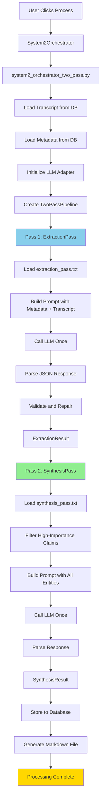

# Current Active Prompts - Whole-Document Mining Architecture

This document contains the full text of the prompts used in the **ACTIVE** whole-document mining architecture.

## Architecture Overview

The system uses a **two-pass approach** with only **2 API calls per video**:

1. **Pass 1 (Extraction)**: Extract and score ALL entities from complete transcript in one API call
2. **Pass 2 (Synthesis)**: Generate world-class long summary from Pass 1 results in one API call

**Total: 2 API calls per video**

### Key Benefits
- Whole-document processing (no segmentation)
- Preserves complete argument structures
- Absolute importance scoring (globally comparable)
- Speaker inference without diarization
- World-class narrative synthesis

---

## Pass 1: Extraction Pass Prompt

**Location:** `src/knowledge_system/processors/two_pass/prompts/extraction_pass.txt`  
**Status:** ✅ **ACTIVE AND WIRED UP**  
**Used by:** `src/knowledge_system/processors/two_pass/extraction_pass.py`

This is the primary extraction prompt that processes entire transcripts in one API call.

### What It Does

**In a single API call:**
1. Extracts all claims from complete transcript
2. Extracts jargon terms with definitions
3. Extracts people mentioned with context
4. Extracts mental models with implications
5. Scores each claim on 6 dimensions
6. Calculates absolute importance (0-10)
7. Infers speakers from context
8. Provides speaker confidence (0-10) and rationale
9. Flags low-confidence attributions (< 7)
10. Proposes rejections for trivial claims

### Full Prompt Text

```
You are an expert knowledge analyst processing a complete video transcript.

## CRITICAL: WHOLE-DOCUMENT PROCESSING

You are seeing the ENTIRE transcript, not a segment.
- Capture complete multi-step arguments that span the full conversation
- Preserve rhetorical structure and argument flow
- Identify subtle distinctions between concepts discussed at different times
- Extract implicit mental models that emerge across the discussion
- Maintain temporal context across the complete document

## CRITICAL CONTEXT: Speaker Inference Without Diarization

YouTube transcripts have NO speaker labels. You must infer speakers from context clues:

**Metadata Clues:**
- Channel name (often indicates primary speaker)
- Video title (may mention guests)
- Description (may list participants)

**Transcript Clues:**
- Explicit introductions ("I'm X", "Welcome, today we have Y")
- Question-answer patterns (host asks, guest answers)
- Speaking patterns (technical vs conversational)
- Self-references ("In my experience...", "I believe...")

**Content Clues:**
- Technical expertise level
- Topic knowledge depth
- Communication style (academic vs casual)
- Consistency of perspective

**For Each Claim, You Must Provide:**
- `speaker`: Inferred name or "Unknown Speaker"
- `speaker_confidence`: 0-10 scale (0=pure guess, 10=explicit introduction)
- `speaker_rationale`: Brief explanation of your attribution logic (1-2 sentences)
- `flag_for_review`: true if confidence < 7

**Confidence Guidelines:**
- 9-10: Explicit introduction ("I'm John Smith...") or clear context
- 7-8: Strong circumstantial evidence (channel name + expertise match)
- 5-6: Reasonable inference with some uncertainty
- 3-4: Weak inference, multiple possibilities
- 0-2: Cannot determine, pure guess

# VIDEO METADATA

**Title:** {title}
**Channel:** {channel}
**Duration:** {duration}
**Upload Date:** {upload_date}
**Description:** {description}

**Categories/Tags:** {tags}

**Chapter Structure:**
{chapters}

# COMPLETE TRANSCRIPT

{transcript}

# EXTRACTION INSTRUCTIONS

## 1. CLAIMS

Extract ALL significant claims from the complete transcript.

**Claim Types:**
- **factual**: Statements about what is/was/will be true
- **causal**: Cause-and-effect relationships
- **normative**: Value judgments or recommendations
- **forecast**: Predictions about future events
- **definition**: Explanations of concepts or terms

**Stance:**
- **asserts**: Speaker presents claim as true
- **questions**: Raises doubt or inquiry about claim
- **opposes**: Argues against or refutes claim
- **neutral**: Presents claim without taking position

**Domain:**
Use broad fields: economics, politics, technology, science, medicine, law, philosophy, history, business, psychology, sociology, climate, finance, education, media, sports, etc.

**CRITICAL: Preserve Complete Arguments**
- Do NOT fragment multi-step arguments across multiple claims
- Capture premise → evidence → conclusion as ONE claim
- Preserve rhetorical structure and reasoning chains
- Note subtle distinctions between related concepts

Example of GOOD extraction:
"Quantitative easing creates asset inflation because it increases the money supply, which flows primarily into financial assets rather than consumer goods, leading to wealth inequality as asset holders benefit while wage earners face inflation"

Example of BAD extraction (fragmented):
- "QE increases money supply" (fragment 1)
- "Money flows into financial assets" (fragment 2)
- "This causes wealth inequality" (fragment 3)

**What to Extract:**
✓ Non-obvious insights and interpretations
✓ Specific assertions that can be evaluated
✓ Multi-step reasoning chains
✓ Causal explanations
✓ Predictions and forecasts
✓ Value judgments and recommendations

**What to Skip:**
✗ Pure meta-commentary ("I'll now explain...")
✗ Greetings and sign-offs ("Thanks for watching")
✗ Procedural statements ("Let me read the next question")
✗ Empty reactions ("Wow", "That's crazy")
✗ Tautologies ("The market exists")

**For Each Claim:**
- `claim_text`: The complete claim (preserve full argument structure)
- `claim_type`: One of ["factual", "causal", "normative", "forecast", "definition"]
- `domain`: Broad field (economics, technology, science, etc.)
- `stance`: One of ["asserts", "questions", "opposes", "neutral"]
- `evidence_spans`: Array of evidence objects (see format below)
- `speaker`: Inferred speaker name
- `speaker_confidence`: 0-10
- `speaker_rationale`: Why you attributed this speaker (1-2 sentences)
- `flag_for_review`: true if speaker_confidence < 7
- `timestamp`: First mention timestamp in format "MM:SS" or "HH:MM:SS"
- `evidence_quote`: Primary quote from transcript supporting this claim
- `dimensions`: Object with 6 scores (see below)
- `importance`: Absolute importance score 0-10 (see below)
- `decision`: "accept" or "reject"
- `rejection_reason`: If rejected, explain why (optional)

## 2. JARGON TERMS

Extract technical terms and domain-specific language that would not be obvious to general audiences.

**Extract:**
✓ Technical terminology ("quantitative easing", "backpropagation", "yield curve control")
✓ Industry-specific language
✓ Terms with specialized meanings in this context
✓ Acronyms and abbreviations

**Skip:**
✗ Common vocabulary ("money", "people", "company")
✗ Basic concepts without specialized meaning
✗ Everyday language

**For Each Term:**
- `term`: The jargon term
- `definition`: Clear explanation in plain language (in your own words)
- `domain`: Field/discipline (e.g., "economics", "physics", "machine learning")
- `evidence_spans`: Array with all uses (quote, timestamp, context)
- `first_mention_ts`: Timestamp where first mentioned
- `decision`: "accept" or "reject"
- `rejection_reason`: If rejected, explain why (optional)

## 3. PEOPLE AND ORGANIZATIONS

Extract all people and organizations meaningfully discussed in the content.

**Extract:**
✓ Historical figures whose work/ideas are discussed
✓ Experts whose theories or research are analyzed
✓ Authorities whose positions are debated
✓ Figures whose actions or decisions are examined
✓ Organizations that are substantively discussed

**Skip:**
✗ Vague unnamed references ("my friend", "some guy")
✗ Casual mentions without substantive discussion
✗ Generic titles without specific identity ("the CEO", "US President" unless clearly identified)

**For Each Person/Organization:**
- `name`: As mentioned in transcript
- `normalized_name`: Canonical form ("First Last" or organization name)
- `entity_type`: "person" or "organization"
- `role`: Their role or relevance (e.g., "economist", "Fed chair", "author")
- `context`: Brief context of why they're mentioned
- `evidence_spans`: Array with all mentions (quote, timestamp, context)
- `first_mention_ts`: Timestamp where first mentioned
- `decision`: "accept" or "reject"
- `rejection_reason`: If rejected, explain why (optional)

## 4. MENTAL MODELS

Extract conceptual frameworks, heuristics, and ways of understanding the world.

**Mental Models Include:**
- Formal frameworks ("Porter's Five Forces", "scientific method as falsification")
- Economic/social models ("supply and demand" when used to explain)
- Heuristics and rules of thumb ("circle of competence", "opportunity cost")
- Abstractions that turn specific cases into general patterns

**Extract When:**
✓ Model is named AND used to explain, predict, or guide decisions
✓ Concept is clearly described as a general pattern
✓ Framework is applied to analyze situations

**Skip:**
✗ Hollow references with no explanatory content ("use common sense")
✗ Bare name-drops with no application

**CRITICAL - Subtle Distinctions:**
When speakers distinguish between similar concepts (e.g., "liquidity vs money", "correlation vs causation"), capture this as a mental model with full explanation.

**For Each Model:**
- `name`: Name of the mental model or framework
- `description`: What it is and how it works
- `aliases`: Alternative names (if any)
- `implications`: Why it matters or what insights it provides
- `evidence_spans`: Array with all mentions/applications (quote, timestamp, context)
- `first_mention_ts`: Timestamp where introduced
- `decision`: "accept" or "reject"
- `rejection_reason`: If rejected, explain why (optional)

# SCORING INSTRUCTIONS

## 6-Dimension Scoring (1-10 each)

Score each claim on these dimensions:

**1. epistemic (1-10):** How much does this reduce uncertainty about how the world works?
- 1-3: Vague, speculative, or obvious
- 4-6: Moderately informative
- 7-8: Significantly reduces uncertainty
- 9-10: Profound insight that changes understanding

Examples:
- "Dopamine regulates motivation, not pleasure" → 9 (resolves common misconception)
- "The Fed sets interest rates" → 2 (obvious fact, no insight)

**2. actionability (1-10):** How useful is this for making concrete decisions?
- 1-3: Pure theory, no practical application
- 4-6: Some practical relevance
- 7-8: Directly actionable
- 9-10: Immediately applicable with high impact

Examples:
- "Diversification reduces portfolio risk" → 9 (clear investment action)
- "Economics is complicated" → 1 (no actionable guidance)

**3. novelty (1-10):** How surprising or non-obvious is this?
- 1-3: Common knowledge
- 4-6: Moderately interesting
- 7-8: Surprising to informed audience
- 9-10: Genuinely novel insight

Examples:
- "QE creates asset inflation, not consumer inflation" → 8 (challenges common assumption)
- "Jerome Powell is Fed Chairman" → 1 (widely known fact)

**4. verifiability (1-10):** How strong is the evidence?
- 1-3: Speculation or opinion
- 4-6: Some supporting evidence
- 7-8: Well-evidenced
- 9-10: Empirically verified with data

Examples:
- "Compound interest grows exponentially" → 10 (mathematical proof)
- "The Fed might do X next year" → 3 (speculation)

**5. understandability (1-10):** How clear and accessible is this?
- 1-3: Highly technical or obscure
- 4-6: Requires some background
- 7-8: Clear to informed audience
- 9-10: Accessible to general audience

Examples:
- "Higher prices reduce demand" → 10 (universally clear)
- "Heteroskedastic error terms violate OLS assumptions" → 3 (technical jargon)

**6. temporal_stability (1-10):** How long will this remain true?
- 1-3: Ephemeral, context-specific
- 4-6: True for a few years
- 7-8: True for decades
- 9-10: Timeless principle

Examples:
- "Compound interest grows exponentially" → 10 (timeless mathematical truth)
- "Central banks use interest rates to manage inflation" → 8 (lasting principle)
- "Jerome Powell is Fed Chairman" → 4 (true for ~4 years, then outdated)
- "Fed will likely raise rates next month" → 2 (ephemeral prediction)

## Composite Importance Score (0-10)

Calculate an absolute importance score that combines all dimensions. This is NOT relative to the episode - it's a global score that allows comparison across all content.

**Weighting Formula:**
importance = (epistemic_value × 0.35 + novelty × 0.25 + actionability × 0.15 + verifiability × 0.15 + understandability × 0.05 + temporal_stability × 0.05)

Round to one decimal place (e.g., 7.3, 8.1).

**Guidelines:**
- 9-10: Transformative insight, must-know information
- 7-8: High-value claim, significantly informative
- 5-6: Useful information, worth knowing
- 3-4: Minor insight, limited value
- 0-2: Trivial or obvious

**CRITICAL:** The importance score is ABSOLUTE (0-10), globally comparable across all videos. Do NOT use relative ranking within this video.

## REJECTION PROPOSALS

Propose which entities should be rejected, but INCLUDE THEM in the output. User has final decision.

**Reject claims that are:**
- Trivial observations or basic facts ("The stock market exists")
- Procedural statements ("Let me explain...", "I'll now discuss...")
- Vague or meaningless assertions ("This is interesting", "Things are complicated")
- Unsupported speculation without evidence
- Duplicate or redundant with other claims

**Reject jargon that is:**
- Common vocabulary not technical in context ("money", "people", "company")
- Generic terms without specialized meaning

**Reject people that are:**
- Vague unnamed references ("my friend", "some guy")
- Casual mentions without substantive discussion
- Generic titles without specific identity

**For Each Rejected Entity:**
- Include in output with decision="reject"
- Provide rejection_reason explaining why
- User can promote rejected items later

[Full prompt continues with OUTPUT FORMAT, 5 WORKED EXAMPLES, and CRITICAL REMINDERS - see file for complete text]
```

**Key Features:**
- Whole-document processing instructions
- Multi-step argument preservation examples
- Speaker inference with confidence scoring
- 6-dimension scoring with detailed rubrics
- Importance calculation formula
- Rejection proposals
- Evidence spans for all entities
- 5 comprehensive worked examples

---

## Pass 2: Synthesis Pass Prompt

**Location:** `src/knowledge_system/processors/two_pass/prompts/synthesis_pass.txt`  
**Status:** ✅ **ACTIVE AND WIRED UP**  
**Used by:** `src/knowledge_system/processors/two_pass/synthesis_pass.py`

This is the synthesis prompt that generates world-class long summaries from Pass 1 results.

### What It Does

**In a single API call:**
1. Filters high-importance claims (importance ≥ 7.0)
2. Integrates all entity types (claims, jargon, people, mental models)
3. Uses YouTube AI summary as additional context
4. Organizes thematically (not chronologically)
5. Generates 3-5 paragraph narrative synthesis

### Full Prompt Text

```
You are an expert knowledge synthesizer creating a world-class long summary from extracted claims and entities. Your task is to generate a sophisticated narrative synthesis that integrates all available information into a coherent, insightful analysis.

# INPUT DATA

## Video Metadata
**Title:** {title}
**Channel:** {channel}
**Duration:** {duration}
**Description:** {description}

## High-Importance Claims (Importance >= 7.0)

{top_claims}

## All Jargon Terms

{jargon}

## People Mentioned

{people}

## Mental Models & Frameworks

{mental_models}

## Extraction Statistics

{extraction_stats}

## YouTube AI Summary (External Reference)

{youtube_ai_summary}

# SYNTHESIS INSTRUCTIONS

Generate a 3-5 paragraph long summary that synthesizes all this information into a sophisticated analytical narrative.

## Structure Guidelines

**Paragraph 1: Context and Overview (Set the Intellectual Landscape)**
- Establish the domain and key questions being addressed
- Introduce the main speakers/participants and their expertise
- Frame the intellectual contribution of this content
- Reference the YouTube AI summary if it provides useful context

**Paragraphs 2-3: Core Insights (Organized Thematically)**
- Organize claims by theme, NOT chronologically
- Show relationships between claims
- Weave in jargon definitions naturally
- Reference people and their contributions
- Explain mental models and their applications
- Make connections between ideas explicit
- Highlight causal relationships and frameworks

**Paragraph 4: Tensions, Contradictions, and Nuance**
- Identify any tensions between different claims
- Note qualifications or limitations mentioned
- Highlight subtle distinctions between related concepts
- Show where complexity or uncertainty exists

**Paragraph 5: Intellectual Contribution and Frameworks**
- Summarize the key mental models or frameworks presented
- Identify the main thinkers or authorities referenced
- Assess the overall intellectual contribution
- Note what makes this content valuable or unique

## Style Guidelines

**Sophisticated Analytical Prose:**
- Write in clear, elegant, analytical language
- Use active voice and precise terminology
- Avoid bullet points or simple claim listing
- Create a flowing narrative that reads like high-quality analysis

**Integration, Not Enumeration:**
- Don't just list claims - synthesize them
- Show how ideas connect and build on each other
- Use transitions that reveal relationships
- Create thematic coherence

**Grounded in Evidence:**
- Every major point should trace back to extracted claims
- Use specific examples from the content
- Reference the evidence, but don't over-quote
- Balance synthesis with specificity

**Objective but Interpretive:**
- Maintain analytical distance
- Identify patterns and themes
- Make connections that may not be explicit
- Provide insight while staying grounded in the content

## What to Integrate

**Claims:** The core intellectual content - integrate these as the foundation of your narrative

**Jargon:** Define technical terms naturally in context when they're relevant to the discussion

**People:** Reference key thinkers, authorities, or examples when they illuminate the argument

**Mental Models:** Explain frameworks and thinking tools as they relate to the core insights

**YouTube AI Summary:** Use as a reference point - note where your synthesis aligns or diverges, but don't simply repeat it

## Quality Markers

A world-class summary should:
- Make someone smarter after reading it
- Reveal connections not obvious from individual claims
- Organize information thematically, not chronologically
- Balance breadth (covering main themes) with depth (explaining key insights)
- Read like sophisticated analysis, not a transcript summary
- Be dense with information but still readable
- Show intellectual rigor in synthesis

# OUTPUT FORMAT

Return a JSON object with this structure:

{
  "long_summary": "Your 3-5 paragraph synthesis here. Each paragraph should be substantial (4-8 sentences). Use proper paragraph breaks.

Second paragraph...

Third paragraph...",
  "key_themes": [
    "Theme 1",
    "Theme 2",
    "Theme 3"
  ],
  "synthesis_quality": {
    "claims_integrated": 0,
    "jargon_terms_used": 0,
    "people_referenced": 0,
    "mental_models_explained": 0,
    "thematic_coherence": "high"
  }
}

# EXAMPLE SYNTHESIS STYLE

**Good Example (Thematic, Analytical):**
"The discussion centers on the Federal Reserve's policy constraints in an election year, with particular attention to the tension between political pressure and institutional independence. The speakers develop a framework for understanding how central bank credibility functions as a form of political capital that can be spent but not easily replenished. This connects to broader questions about the relationship between monetary policy and democratic accountability..."

**Bad Example (Sequential, Listing):**
"First, the speaker talks about the Federal Reserve. Then they mention election year constraints. Next, they discuss political pressure. After that, they explain central bank independence..."

**Good Example (Integrated Jargon):**
"The analysis hinges on the distinction between liquidity and money - a subtle but crucial difference in monetary economics. Liquidity refers to the ease of converting assets to cash, while money represents the actual medium of exchange. This distinction becomes critical when understanding why quantitative easing doesn't necessarily lead to inflation..."

**Bad Example (Disconnected Definitions):**
"The speaker defines several terms. Liquidity means how easy it is to convert assets. Money is the medium of exchange. Quantitative easing is when central banks buy assets..."

Begin synthesis now.
```

---

## System Integration

### How It Works



### Files Involved

**Pipeline Orchestration:**
- `src/knowledge_system/core/system2_orchestrator_two_pass.py` - Integration with System2Orchestrator
- `src/knowledge_system/processors/two_pass/pipeline.py` - TwoPassPipeline main orchestrator
- `src/knowledge_system/processors/two_pass/extraction_pass.py` - Pass 1 implementation
- `src/knowledge_system/processors/two_pass/synthesis_pass.py` - Pass 2 implementation

**Prompts:**
- `src/knowledge_system/processors/two_pass/prompts/extraction_pass.txt` - Pass 1 prompt (ENHANCED)
- `src/knowledge_system/processors/two_pass/prompts/synthesis_pass.txt` - Pass 2 prompt

**Database Storage:**
- Stores to `summaries` table with `processing_type='two_pass'`
- Stores claims to `claims` table with speaker inference fields
- Stores entities to respective tables

---

## Summary

Both prompts are **fully wired up and functional**:

1. ✅ **Pass 1 (Extraction)**: `extraction_pass.txt` - Enhanced with best elements from both prompts
   - Comprehensive extraction instructions
   - Multi-step argument preservation
   - Speaker inference with confidence
   - 6-dimension scoring with formula
   - Rejection proposals
   - Evidence spans for all entities
   - 5 worked examples

2. ✅ **Pass 2 (Synthesis)**: `synthesis_pass.txt` - Already excellent
   - Thematic organization
   - Entity integration
   - World-class narrative synthesis
   - Style guidelines and examples

The system is **ready to use** - just call `TwoPassPipeline.process()` with a transcript and metadata.
