# Two-Pass System Architecture - Visual Flowcharts

**Date:** December 22, 2025  
**Purpose:** Visual guide to understanding the new two-pass architecture

---

## Table of Contents

1. [High-Level Overview](#high-level-overview)
2. [Complete Processing Flow](#complete-processing-flow)
3. [Pass 1: Extraction Pass](#pass-1-extraction-pass)
4. [Pass 2: Synthesis Pass](#pass-2-synthesis-pass)
5. [System Integration](#system-integration)
6. [GUI Workflow](#gui-workflow)
7. [Data Flow](#data-flow)
8. [Comparison: Old vs New](#comparison-old-vs-new)

---

## High-Level Overview

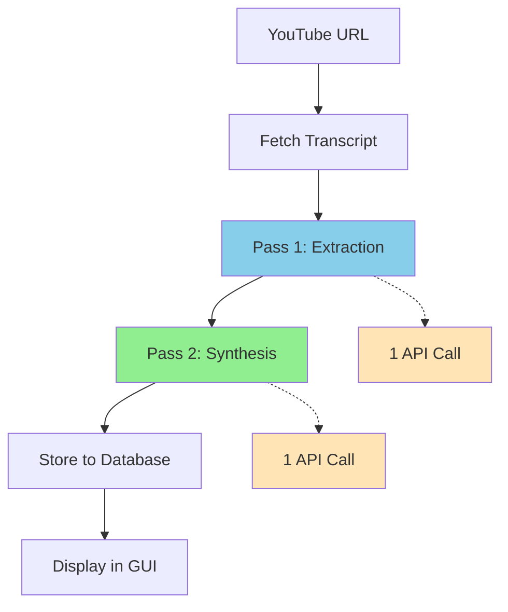
```mermaid
flowchart TD
    Start[YouTube URL] --> Fetch[Fetch Transcript]
    Fetch --> Pass1[Pass 1: Extraction]
    Pass1 --> Pass2[Pass 2: Synthesis]
    Pass2 --> Store[Store to Database]
    Store --> Display[Display in GUI]
    
    Pass1 -.-> API1[1 API Call]
    Pass2 -.-> API2[1 API Call]
    
    style Pass1 fill:#87CEEB
    style Pass2 fill:#90EE90
    style API1 fill:#FFE4B5
    style API2 fill:#FFE4B5
```

**Key Principle:** Only 2 API calls per video, whole-document processing

---

## Complete Processing Flow

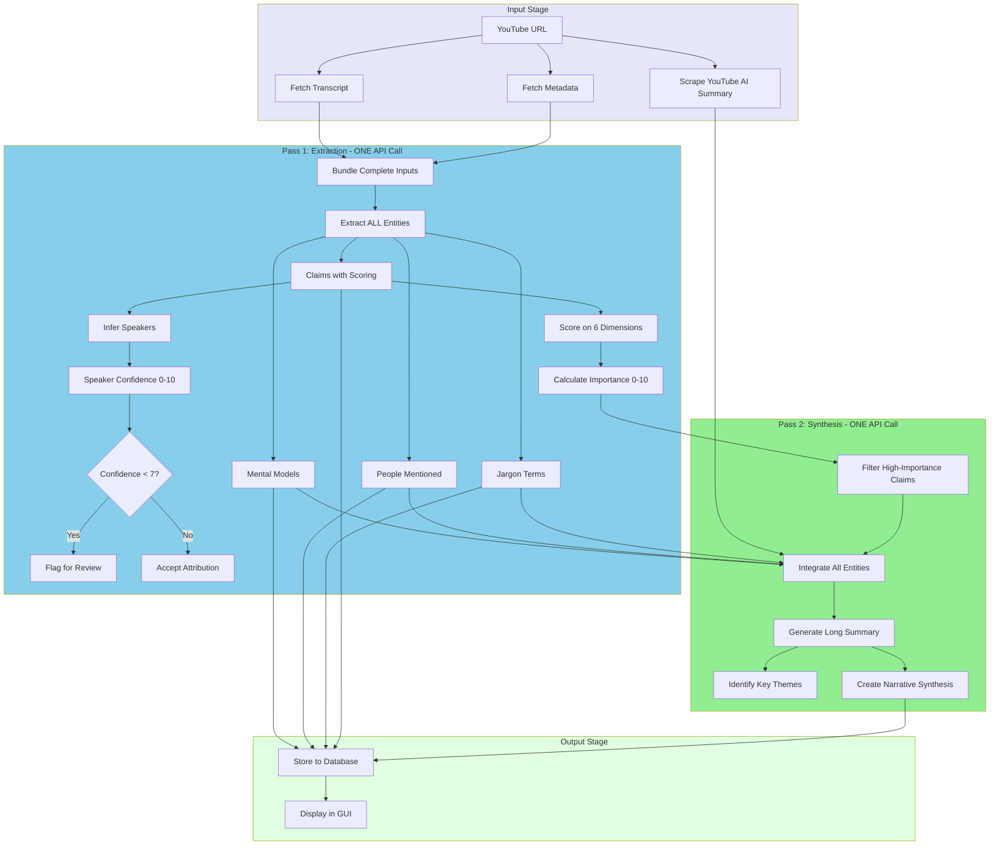
```mermaid
flowchart TD
    subgraph Input [Input Stage]
        URL[YouTube URL]
        URL --> Meta[Fetch Metadata]
        URL --> Trans[Fetch Transcript]
        URL --> YTAI[Scrape YouTube AI Summary]
    end
    
    subgraph Pass1 [Pass 1: Extraction - ONE API Call]
        Bundle[Bundle Complete Inputs]
        Meta --> Bundle
        Trans --> Bundle
        
        Bundle --> Extract[Extract ALL Entities]
        
        Extract --> Claims[Claims with Scoring]
        Extract --> Jargon[Jargon Terms]
        Extract --> People[People Mentioned]
        Extract --> Models[Mental Models]
        
        Claims --> Score[Score on 6 Dimensions]
        Score --> Importance[Calculate Importance 0-10]
        Claims --> Speaker[Infer Speakers]
        Speaker --> Confidence[Speaker Confidence 0-10]
        Confidence --> Flag{Confidence < 7?}
        Flag -->|Yes| Review[Flag for Review]
        Flag -->|No| Accept[Accept Attribution]
    end
    
    subgraph Pass2 [Pass 2: Synthesis - ONE API Call]
        Filter[Filter High-Importance Claims]
        Importance --> Filter
        
        Integrate[Integrate All Entities]
        Filter --> Integrate
        Jargon --> Integrate
        People --> Integrate
        Models --> Integrate
        YTAI --> Integrate
        
        Integrate --> Generate[Generate Long Summary]
        Generate --> Themes[Identify Key Themes]
        Generate --> Narrative[Create Narrative Synthesis]
    end
    
    subgraph Output [Output Stage]
        StoreDB[Store to Database]
        Narrative --> StoreDB
        Claims --> StoreDB
        Jargon --> StoreDB
        People --> StoreDB
        Models --> StoreDB
        
        StoreDB --> GUI[Display in GUI]
    end
    
    style Pass1 fill:#87CEEB
    style Pass2 fill:#90EE90
    style Input fill:#E6E6FA
    style Output fill:#E0FFE0
```

---

## Pass 1: Extraction Pass

### Extraction Pass Architecture

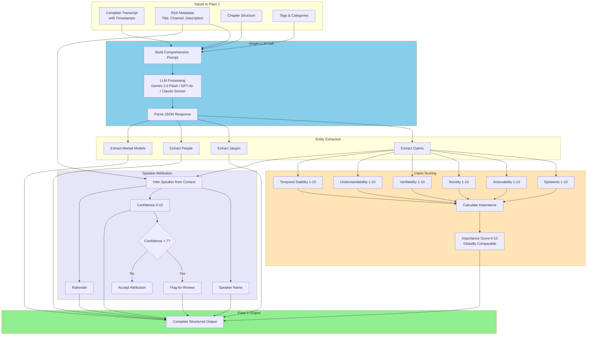
```mermaid
flowchart TD
    subgraph Inputs [Inputs to Pass 1]
        T[Complete Transcript<br/>with Timestamps]
        M[Rich Metadata<br/>Title, Channel, Description]
        C[Chapter Structure]
        Tag[Tags & Categories]
    end
    
    subgraph Processing [Single LLM Call]
        Prompt[Build Comprehensive Prompt]
        T --> Prompt
        M --> Prompt
        C --> Prompt
        Tag --> Prompt
        
        Prompt --> LLM[LLM Processing<br/>Gemini 2.0 Flash / GPT-4o / Claude Sonnet]
        
        LLM --> Parse[Parse JSON Response]
    end
    
    subgraph Extraction [Entity Extraction]
        Parse --> E1[Extract Claims]
        Parse --> E2[Extract Jargon]
        Parse --> E3[Extract People]
        Parse --> E4[Extract Mental Models]
    end
    
    subgraph Scoring [Claim Scoring]
        E1 --> D1[Epistemic 1-10]
        E1 --> D2[Actionability 1-10]
        E1 --> D3[Novelty 1-10]
        E1 --> D4[Verifiability 1-10]
        E1 --> D5[Understandability 1-10]
        E1 --> D6[Temporal Stability 1-10]
        
        D1 --> Calc[Calculate Importance]
        D2 --> Calc
        D3 --> Calc
        D4 --> Calc
        D5 --> Calc
        D6 --> Calc
        
        Calc --> ImpScore[Importance Score 0-10<br/>Globally Comparable]
    end
    
    subgraph Attribution [Speaker Attribution]
        E1 --> Infer[Infer Speaker from Context]
        M --> Infer
        
        Infer --> SName[Speaker Name]
        Infer --> SConf[Confidence 0-10]
        Infer --> SRat[Rationale]
        
        SConf --> Check{Confidence < 7?}
        Check -->|Yes| FlagRev[Flag for Review]
        Check -->|No| AcceptAttr[Accept Attribution]
    end
    
    subgraph Output1 [Pass 1 Output]
        Result[Complete Structured Output]
        ImpScore --> Result
        E2 --> Result
        E3 --> Result
        E4 --> Result
        SName --> Result
        SConf --> Result
        SRat --> Result
        FlagRev --> Result
    end
    
    style Processing fill:#87CEEB
    style Scoring fill:#FFE4B5
    style Attribution fill:#E6E6FA
    style Output1 fill:#90EE90
```

### Speaker Inference Logic

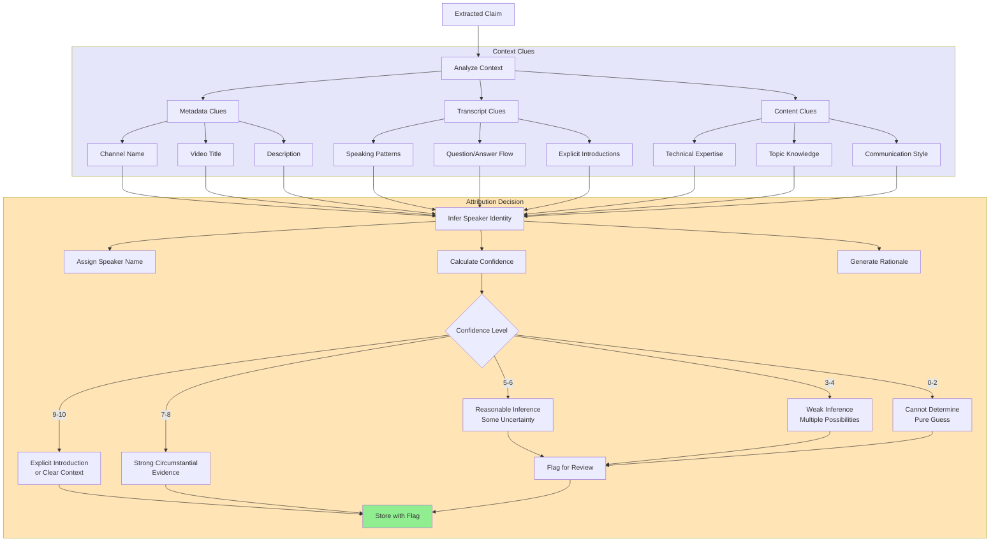
```mermaid
flowchart TD
    Claim[Extracted Claim] --> Analyze[Analyze Context]
    
    subgraph Clues [Context Clues]
        Analyze --> Meta[Metadata Clues]
        Analyze --> Trans[Transcript Clues]
        Analyze --> Content[Content Clues]
        
        Meta --> Channel[Channel Name]
        Meta --> Title[Video Title]
        Meta --> Desc[Description]
        
        Trans --> Patterns[Speaking Patterns]
        Trans --> QA[Question/Answer Flow]
        Trans --> Intro[Explicit Introductions]
        
        Content --> Expertise[Technical Expertise]
        Content --> Topics[Topic Knowledge]
        Content --> Style[Communication Style]
    end
    
    subgraph Decision [Attribution Decision]
        Channel --> Infer[Infer Speaker Identity]
        Title --> Infer
        Desc --> Infer
        Patterns --> Infer
        QA --> Infer
        Intro --> Infer
        Expertise --> Infer
        Topics --> Infer
        Style --> Infer
        
        Infer --> Assign[Assign Speaker Name]
        Infer --> CalcConf[Calculate Confidence]
        Infer --> Explain[Generate Rationale]
        
        CalcConf --> ConfLevel{Confidence Level}
        
        ConfLevel -->|9-10| Explicit[Explicit Introduction<br/>or Clear Context]
        ConfLevel -->|7-8| Strong[Strong Circumstantial<br/>Evidence]
        ConfLevel -->|5-6| Reasonable[Reasonable Inference<br/>Some Uncertainty]
        ConfLevel -->|3-4| Weak[Weak Inference<br/>Multiple Possibilities]
        ConfLevel -->|0-2| Unknown[Cannot Determine<br/>Pure Guess]
        
        Explicit --> Store
        Strong --> Store
        Reasonable --> Flag[Flag for Review]
        Weak --> Flag
        Unknown --> Flag
        
        Flag --> Store[Store with Flag]
    end
    
    style Clues fill:#E6E6FA
    style Decision fill:#FFE4B5
    style Store fill:#90EE90
```

---

## Pass 2: Synthesis Pass

### Synthesis Pass Architecture

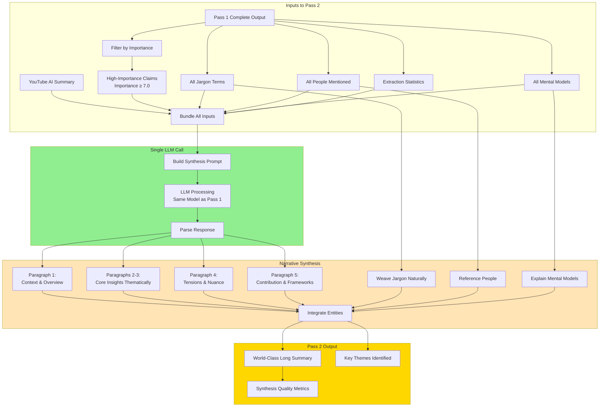
```mermaid
flowchart TD
    subgraph Inputs [Inputs to Pass 2]
        Pass1[Pass 1 Complete Output]
        
        Pass1 --> Filter[Filter by Importance]
        Filter --> HighClaims[High-Importance Claims<br/>Importance ≥ 7.0]
        
        Pass1 --> AllJargon[All Jargon Terms]
        Pass1 --> AllPeople[All People Mentioned]
        Pass1 --> AllModels[All Mental Models]
        Pass1 --> Stats[Extraction Statistics]
        
        External[YouTube AI Summary] --> Bundle
        
        HighClaims --> Bundle[Bundle All Inputs]
        AllJargon --> Bundle
        AllPeople --> Bundle
        AllModels --> Bundle
        Stats --> Bundle
    end
    
    subgraph Processing [Single LLM Call]
        Bundle --> Prompt[Build Synthesis Prompt]
        Prompt --> LLM[LLM Processing<br/>Same Model as Pass 1]
        LLM --> Parse[Parse Response]
    end
    
    subgraph Synthesis [Narrative Synthesis]
        Parse --> Para1[Paragraph 1:<br/>Context & Overview]
        Parse --> Para2[Paragraphs 2-3:<br/>Core Insights Thematically]
        Parse --> Para3[Paragraph 4:<br/>Tensions & Nuance]
        Parse --> Para4[Paragraph 5:<br/>Contribution & Frameworks]
        
        Para1 --> Integrate[Integrate Entities]
        Para2 --> Integrate
        Para3 --> Integrate
        Para4 --> Integrate
        
        AllJargon --> WeaveJargon[Weave Jargon Naturally]
        AllPeople --> RefPeople[Reference People]
        AllModels --> ExplainModels[Explain Mental Models]
        
        WeaveJargon --> Integrate
        RefPeople --> Integrate
        ExplainModels --> Integrate
    end
    
    subgraph Output2 [Pass 2 Output]
        Integrate --> Summary[World-Class Long Summary]
        Integrate --> Themes[Key Themes Identified]
        
        Summary --> Quality[Synthesis Quality Metrics]
    end
    
    style Processing fill:#90EE90
    style Synthesis fill:#FFE4B5
    style Output2 fill:#FFD700
```

### Synthesis Integration Strategy

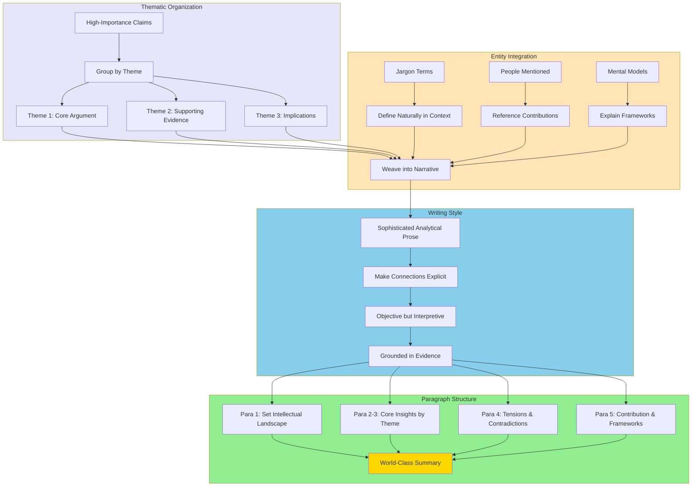
```mermaid
flowchart TD
    subgraph Organization [Thematic Organization]
        Claims[High-Importance Claims] --> Group[Group by Theme]
        Group --> Theme1[Theme 1: Core Argument]
        Group --> Theme2[Theme 2: Supporting Evidence]
        Group --> Theme3[Theme 3: Implications]
    end
    
    subgraph Integration [Entity Integration]
        Theme1 --> Weave[Weave into Narrative]
        Theme2 --> Weave
        Theme3 --> Weave
        
        Jargon[Jargon Terms] --> Define[Define Naturally in Context]
        People[People Mentioned] --> Reference[Reference Contributions]
        Models[Mental Models] --> Explain[Explain Frameworks]
        
        Define --> Weave
        Reference --> Weave
        Explain --> Weave
    end
    
    subgraph Style [Writing Style]
        Weave --> Sophisticated[Sophisticated Analytical Prose]
        Sophisticated --> Connections[Make Connections Explicit]
        Connections --> Objective[Objective but Interpretive]
        Objective --> Grounded[Grounded in Evidence]
    end
    
    subgraph Structure [Paragraph Structure]
        Grounded --> P1[Para 1: Set Intellectual Landscape]
        Grounded --> P2[Para 2-3: Core Insights by Theme]
        Grounded --> P3[Para 4: Tensions & Contradictions]
        Grounded --> P4[Para 5: Contribution & Frameworks]
        
        P1 --> Final[World-Class Summary]
        P2 --> Final
        P3 --> Final
        P4 --> Final
    end
    
    style Organization fill:#E6E6FA
    style Integration fill:#FFE4B5
    style Style fill:#87CEEB
    style Structure fill:#90EE90
    style Final fill:#FFD700
```

---

## System Integration

### System2Orchestrator Integration

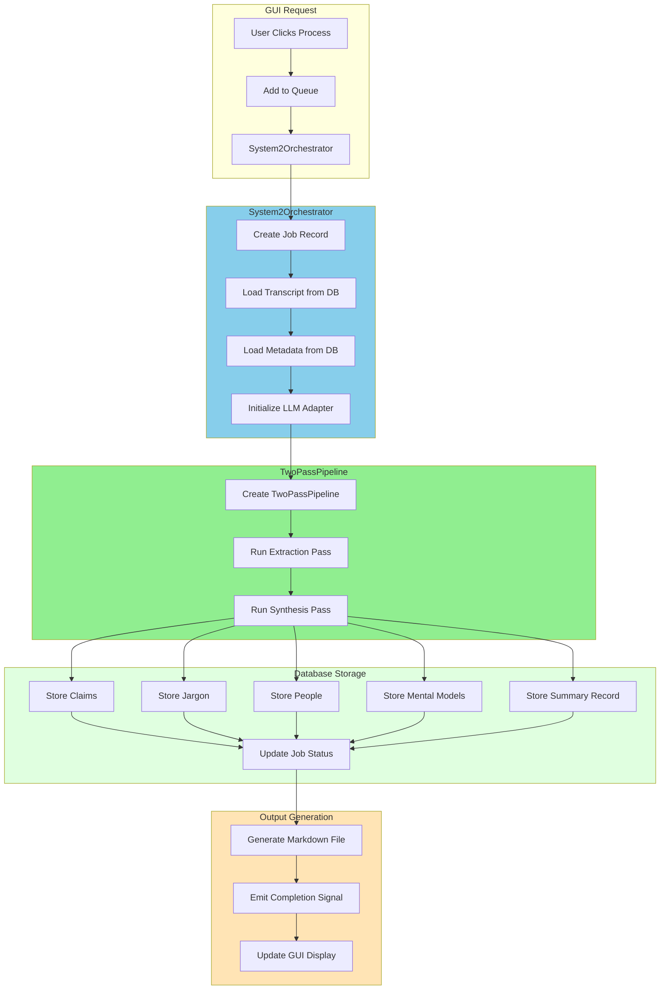
```mermaid
flowchart TD
    subgraph GUI [GUI Request]
        User[User Clicks Process] --> Queue[Add to Queue]
        Queue --> Orch[System2Orchestrator]
    end
    
    subgraph Orchestrator [System2Orchestrator]
        Orch --> CreateJob[Create Job Record]
        CreateJob --> LoadTrans[Load Transcript from DB]
        LoadTrans --> LoadMeta[Load Metadata from DB]
        LoadMeta --> InitLLM[Initialize LLM Adapter]
    end
    
    subgraph Pipeline [TwoPassPipeline]
        InitLLM --> CreatePipe[Create TwoPassPipeline]
        CreatePipe --> RunPass1[Run Extraction Pass]
        RunPass1 --> RunPass2[Run Synthesis Pass]
    end
    
    subgraph Storage [Database Storage]
        RunPass2 --> StoreClaims[Store Claims]
        RunPass2 --> StoreJargon[Store Jargon]
        RunPass2 --> StorePeople[Store People]
        RunPass2 --> StoreModels[Store Mental Models]
        RunPass2 --> StoreSummary[Store Summary Record]
        
        StoreClaims --> UpdateJob[Update Job Status]
        StoreJargon --> UpdateJob
        StorePeople --> UpdateJob
        StoreModels --> UpdateJob
        StoreSummary --> UpdateJob
    end
    
    subgraph Output [Output Generation]
        UpdateJob --> GenMarkdown[Generate Markdown File]
        GenMarkdown --> EmitComplete[Emit Completion Signal]
        EmitComplete --> GUIUpdate[Update GUI Display]
    end
    
    style Orchestrator fill:#87CEEB
    style Pipeline fill:#90EE90
    style Storage fill:#E0FFE0
    style Output fill:#FFE4B5
```

### Database Storage Flow

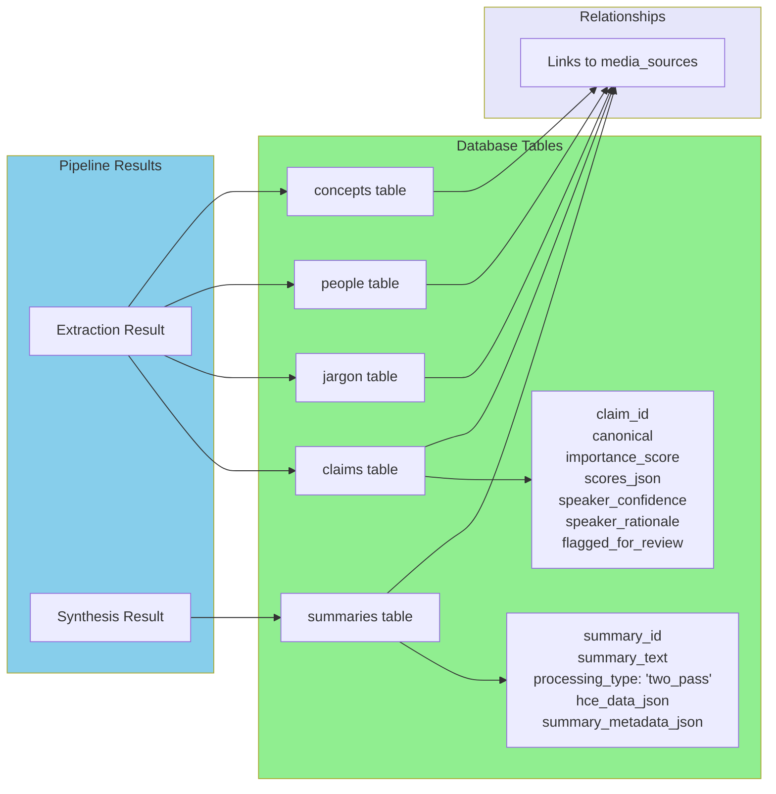
```mermaid
flowchart LR
    subgraph Results [Pipeline Results]
        Extract[Extraction Result]
        Synth[Synthesis Result]
    end
    
    subgraph Tables [Database Tables]
        Extract --> ClaimsTable[claims table]
        Extract --> JargonTable[jargon table]
        Extract --> PeopleTable[people table]
        Extract --> ConceptsTable[concepts table]
        
        Synth --> SummaryTable[summaries table]
        
        ClaimsTable --> Fields1[claim_id<br/>canonical<br/>importance_score<br/>scores_json<br/>speaker_confidence<br/>speaker_rationale<br/>flagged_for_review]
        
        SummaryTable --> Fields2[summary_id<br/>summary_text<br/>processing_type: 'two_pass'<br/>hce_data_json<br/>summary_metadata_json]
    end
    
    subgraph Relationships [Relationships]
        ClaimsTable --> SourceLink[Links to media_sources]
        JargonTable --> SourceLink
        PeopleTable --> SourceLink
        ConceptsTable --> SourceLink
        SummaryTable --> SourceLink
    end
    
    style Results fill:#87CEEB
    style Tables fill:#90EE90
    style Relationships fill:#E6E6FA
```

---

## GUI Workflow

### TwoPassWorker Flow

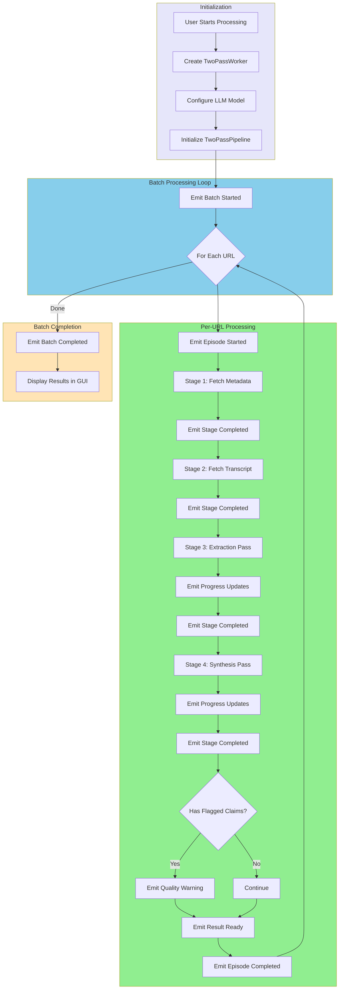
```mermaid
flowchart TD
    subgraph Init [Initialization]
        Start[User Starts Processing] --> Worker[Create TwoPassWorker]
        Worker --> Config[Configure LLM Model]
        Config --> InitPipe[Initialize TwoPassPipeline]
    end
    
    subgraph Batch [Batch Processing Loop]
        InitPipe --> BatchStart[Emit Batch Started]
        BatchStart --> Loop{For Each URL}
    end
    
    subgraph PerURL [Per-URL Processing]
        Loop --> EpisodeStart[Emit Episode Started]
        
        EpisodeStart --> Stage1[Stage 1: Fetch Metadata]
        Stage1 --> Complete1[Emit Stage Completed]
        
        Complete1 --> Stage2[Stage 2: Fetch Transcript]
        Stage2 --> Complete2[Emit Stage Completed]
        
        Complete2 --> Stage3[Stage 3: Extraction Pass]
        Stage3 --> Progress3[Emit Progress Updates]
        Progress3 --> Complete3[Emit Stage Completed]
        
        Complete3 --> Stage4[Stage 4: Synthesis Pass]
        Stage4 --> Progress4[Emit Progress Updates]
        Progress4 --> Complete4[Emit Stage Completed]
        
        Complete4 --> CheckFlag{Has Flagged Claims?}
        CheckFlag -->|Yes| Warning[Emit Quality Warning]
        CheckFlag -->|No| NoWarn[Continue]
        
        Warning --> EmitResult[Emit Result Ready]
        NoWarn --> EmitResult
        
        EmitResult --> EpisodeComplete[Emit Episode Completed]
        EpisodeComplete --> Loop
    end
    
    subgraph Completion [Batch Completion]
        Loop -->|Done| BatchComplete[Emit Batch Completed]
        BatchComplete --> DisplayResults[Display Results in GUI]
    end
    
    style Init fill:#E6E6FA
    style Batch fill:#87CEEB
    style PerURL fill:#90EE90
    style Completion fill:#FFE4B5
```

### GUI Stage Progression

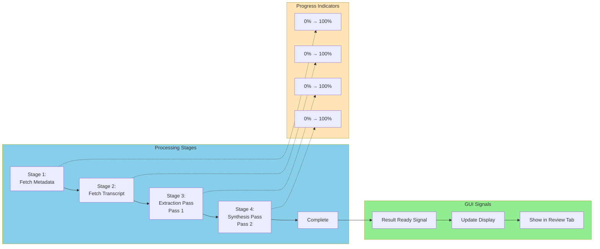
```mermaid
flowchart LR
    subgraph Stages [Processing Stages]
        S1[Stage 1:<br/>Fetch Metadata] --> S2[Stage 2:<br/>Fetch Transcript]
        S2 --> S3[Stage 3:<br/>Extraction Pass<br/>Pass 1]
        S3 --> S4[Stage 4:<br/>Synthesis Pass<br/>Pass 2]
        S4 --> Done[Complete]
    end
    
    subgraph Progress [Progress Indicators]
        S1 -.-> P1[0% → 100%]
        S2 -.-> P2[0% → 100%]
        S3 -.-> P3[0% → 100%]
        S4 -.-> P4[0% → 100%]
    end
    
    subgraph Signals [GUI Signals]
        Done --> Result[Result Ready Signal]
        Result --> Display[Update Display]
        Display --> Review[Show in Review Tab]
    end
    
    style Stages fill:#87CEEB
    style Progress fill:#FFE4B5
    style Signals fill:#90EE90
```

---

## Data Flow

### Complete Data Flow Diagram

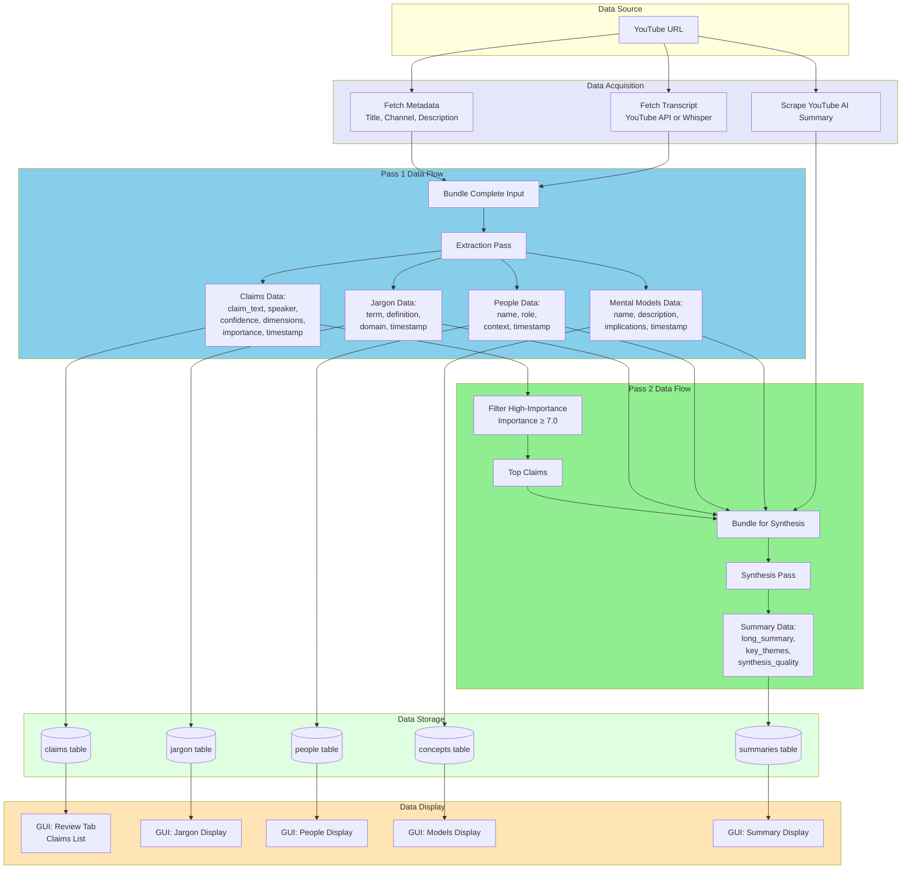
```mermaid
flowchart TD
    subgraph Source [Data Source]
        URL[YouTube URL]
    end
    
    subgraph Acquisition [Data Acquisition]
        URL --> FetchMeta[Fetch Metadata<br/>Title, Channel, Description]
        URL --> FetchTrans[Fetch Transcript<br/>YouTube API or Whisper]
        URL --> FetchYTAI[Scrape YouTube AI Summary]
    end
    
    subgraph Pass1Data [Pass 1 Data Flow]
        FetchMeta --> Bundle1[Bundle Complete Input]
        FetchTrans --> Bundle1
        
        Bundle1 --> ExtractPass[Extraction Pass]
        
        ExtractPass --> ClaimsData[Claims Data:<br/>claim_text, speaker,<br/>confidence, dimensions,<br/>importance, timestamp]
        
        ExtractPass --> JargonData[Jargon Data:<br/>term, definition,<br/>domain, timestamp]
        
        ExtractPass --> PeopleData[People Data:<br/>name, role,<br/>context, timestamp]
        
        ExtractPass --> ModelsData[Mental Models Data:<br/>name, description,<br/>implications, timestamp]
    end
    
    subgraph Pass2Data [Pass 2 Data Flow]
        ClaimsData --> Filter[Filter High-Importance<br/>Importance ≥ 7.0]
        Filter --> TopClaims[Top Claims]
        
        TopClaims --> Bundle2[Bundle for Synthesis]
        JargonData --> Bundle2
        PeopleData --> Bundle2
        ModelsData --> Bundle2
        FetchYTAI --> Bundle2
        
        Bundle2 --> SynthPass[Synthesis Pass]
        
        SynthPass --> SummaryData[Summary Data:<br/>long_summary,<br/>key_themes,<br/>synthesis_quality]
    end
    
    subgraph Storage [Data Storage]
        ClaimsData --> DBClaims[(claims table)]
        JargonData --> DBJargon[(jargon table)]
        PeopleData --> DBPeople[(people table)]
        ModelsData --> DBConcepts[(concepts table)]
        SummaryData --> DBSummary[(summaries table)]
    end
    
    subgraph Display [Data Display]
        DBClaims --> GUIClaims[GUI: Review Tab<br/>Claims List]
        DBJargon --> GUIJargon[GUI: Jargon Display]
        DBPeople --> GUIPeople[GUI: People Display]
        DBConcepts --> GUIModels[GUI: Models Display]
        DBSummary --> GUISummary[GUI: Summary Display]
    end
    
    style Acquisition fill:#E6E6FA
    style Pass1Data fill:#87CEEB
    style Pass2Data fill:#90EE90
    style Storage fill:#E0FFE0
    style Display fill:#FFE4B5
```

---

## Comparison: Old vs New

### Old System: Two-Step (Segment-Based)

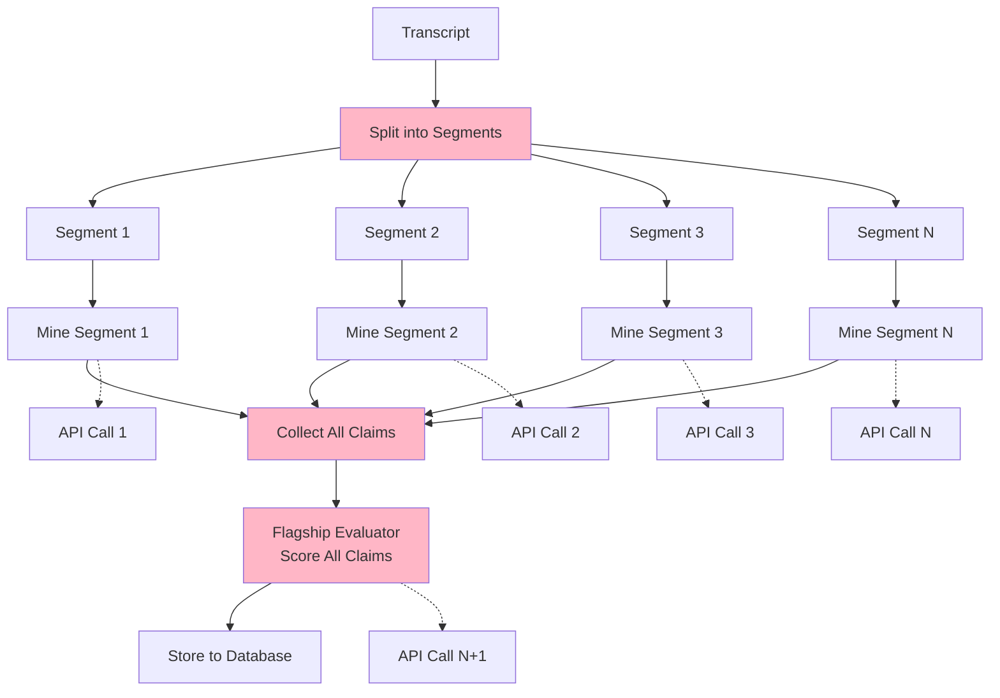
```mermaid
flowchart TD
    Start[Transcript] --> Split[Split into Segments]
    Split --> Seg1[Segment 1]
    Split --> Seg2[Segment 2]
    Split --> Seg3[Segment 3]
    Split --> SegN[Segment N]
    
    Seg1 --> Mine1[Mine Segment 1]
    Seg2 --> Mine2[Mine Segment 2]
    Seg3 --> Mine3[Mine Segment 3]
    SegN --> MineN[Mine Segment N]
    
    Mine1 --> Collect[Collect All Claims]
    Mine2 --> Collect
    Mine3 --> Collect
    MineN --> Collect
    
    Collect --> Eval[Flagship Evaluator<br/>Score All Claims]
    Eval --> Store[Store to Database]
    
    Mine1 -.-> API1[API Call 1]
    Mine2 -.-> API2[API Call 2]
    Mine3 -.-> API3[API Call 3]
    MineN -.-> APIN[API Call N]
    Eval -.-> APIEval[API Call N+1]
    
    style Split fill:#FFB6C6
    style Collect fill:#FFB6C6
    style Eval fill:#FFB6C6
```

**Problems:**
- Claims fragmented across segment boundaries
- Lost context between segments
- Many API calls (N segments + 1 evaluation)
- Complex coordination

### New System: Two-Pass (Whole-Document)

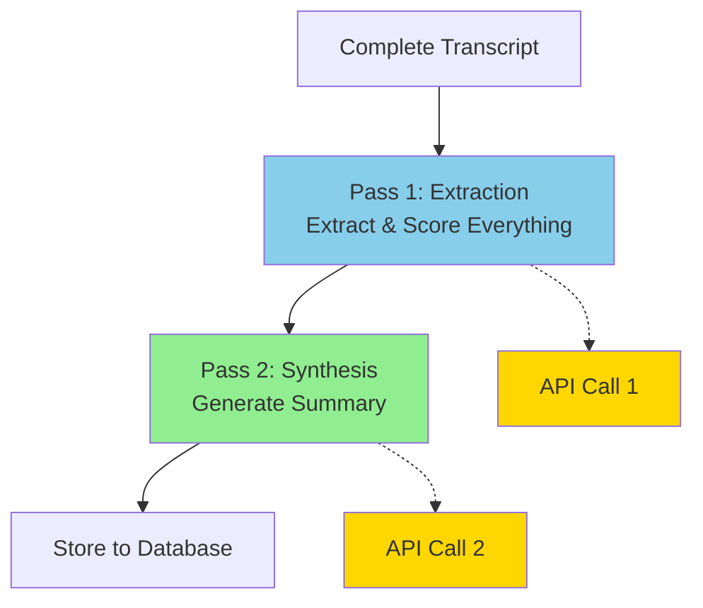
```mermaid
flowchart TD
    Start[Complete Transcript] --> Pass1[Pass 1: Extraction<br/>Extract & Score Everything]
    Pass1 --> Pass2[Pass 2: Synthesis<br/>Generate Summary]
    Pass2 --> Store[Store to Database]
    
    Pass1 -.-> API1[API Call 1]
    Pass2 -.-> API2[API Call 2]
    
    style Pass1 fill:#87CEEB
    style Pass2 fill:#90EE90
    style API1 fill:#FFD700
    style API2 fill:#FFD700
```

**Benefits:**
- Complete context preserved
- Only 2 API calls total
- Simpler architecture
- Better quality results

### Side-by-Side Comparison

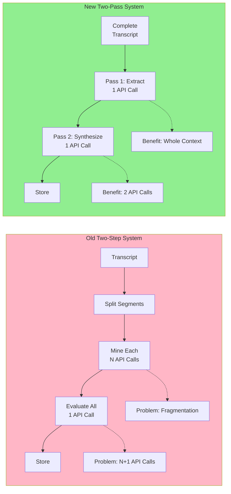
```mermaid
flowchart LR
    subgraph Old [Old Two-Step System]
        O1[Transcript] --> O2[Split Segments]
        O2 --> O3[Mine Each<br/>N API Calls]
        O3 --> O4[Evaluate All<br/>1 API Call]
        O4 --> O5[Store]
        
        O3 -.-> OProb1[Problem: Fragmentation]
        O4 -.-> OProb2[Problem: N+1 API Calls]
    end
    
    subgraph New [New Two-Pass System]
        N1[Complete<br/>Transcript] --> N2[Pass 1: Extract<br/>1 API Call]
        N2 --> N3[Pass 2: Synthesize<br/>1 API Call]
        N3 --> N4[Store]
        
        N2 -.-> NBen1[Benefit: Whole Context]
        N3 -.-> NBen2[Benefit: 2 API Calls]
    end
    
    style Old fill:#FFB6C6
    style New fill:#90EE90
```

---

## Summary

### Key Architectural Principles

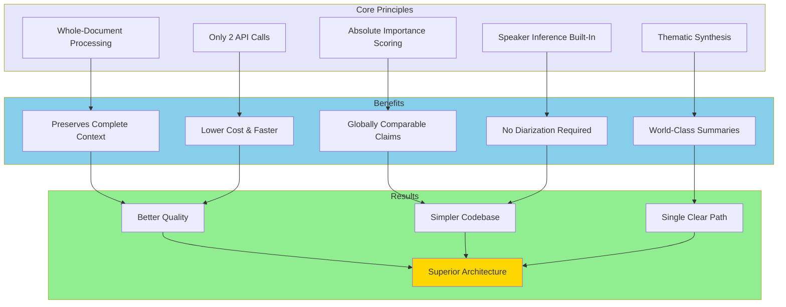
```mermaid
flowchart TD
    subgraph Principles [Core Principles]
        P1[Whole-Document Processing]
        P2[Only 2 API Calls]
        P3[Absolute Importance Scoring]
        P4[Speaker Inference Built-In]
        P5[Thematic Synthesis]
    end
    
    subgraph Benefits [Benefits]
        P1 --> B1[Preserves Complete Context]
        P2 --> B2[Lower Cost & Faster]
        P3 --> B3[Globally Comparable Claims]
        P4 --> B4[No Diarization Required]
        P5 --> B5[World-Class Summaries]
    end
    
    subgraph Results [Results]
        B1 --> R1[Better Quality]
        B2 --> R1
        B3 --> R2[Simpler Codebase]
        B4 --> R2
        B5 --> R3[Single Clear Path]
        
        R1 --> Final[Superior Architecture]
        R2 --> Final
        R3 --> Final
    end
    
    style Principles fill:#E6E6FA
    style Benefits fill:#87CEEB
    style Results fill:#90EE90
    style Final fill:#FFD700
```

### Processing Summary

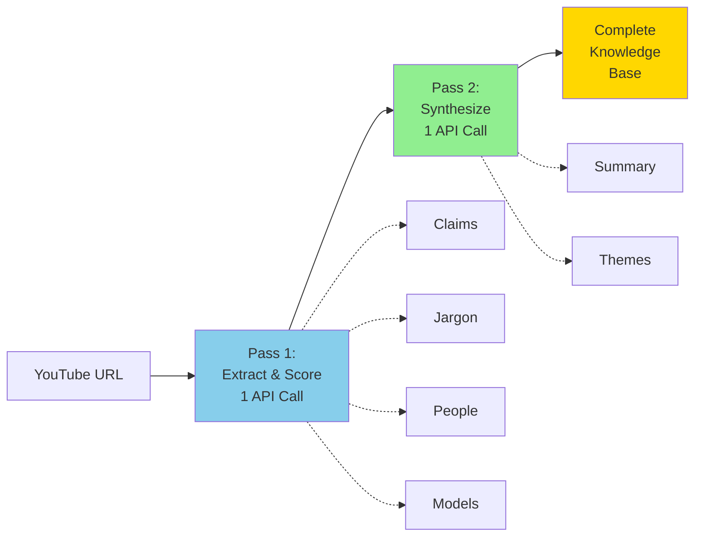
```mermaid
flowchart LR
    Input[YouTube URL] --> P1[Pass 1:<br/>Extract & Score<br/>1 API Call]
    P1 --> P2[Pass 2:<br/>Synthesize<br/>1 API Call]
    P2 --> Output[Complete<br/>Knowledge<br/>Base]
    
    P1 -.-> E1[Claims]
    P1 -.-> E2[Jargon]
    P1 -.-> E3[People]
    P1 -.-> E4[Models]
    
    P2 -.-> S1[Summary]
    P2 -.-> S2[Themes]
    
    style P1 fill:#87CEEB
    style P2 fill:#90EE90
    style Output fill:#FFD700
```

---

## Conclusion

The two-pass system represents a fundamental architectural improvement:

- **Simpler**: Single clear processing path
- **Faster**: Only 2 API calls per video
- **Better**: Whole-document context preserved
- **Cheaper**: Fewer tokens, lower cost
- **Clearer**: No confusion between parallel systems

All processing flows through the same pipeline, making the system easier to understand, maintain, and improve.

