# Whole-Document Mining - Detailed Conceptual Plan

## Executive Summary

Complete redesign of the claim extraction system using whole-document processing. The new system processes each YouTube URL in exactly 2 API calls: Pass 1 extracts and scores all claims from the complete transcript, Pass 2 generates a world-class long summary grounded in those claims. This eliminates claim fragmentation, preserves complete argument structures, and captures nuanced reasoning that spans entire conversations.

## The New Workflow (Only Path Forward)

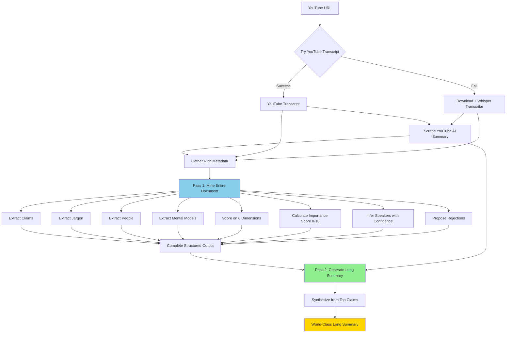

**Key Principles:**
- Try YouTube transcript first (faster, free)
- Only use Whisper if YouTube transcript unavailable
- Process entire document in Pass 1 (no segmentation)
- Extract ALL entity types in Pass 1 (claims, jargon, people, mental models)
- Pass 2 synthesizes long summary from Pass 1 results
- Total: 2 API calls per URL

## Detailed Process Flow

### Stage 1: Transcript Acquisition (YouTube First, Whisper Fallback)

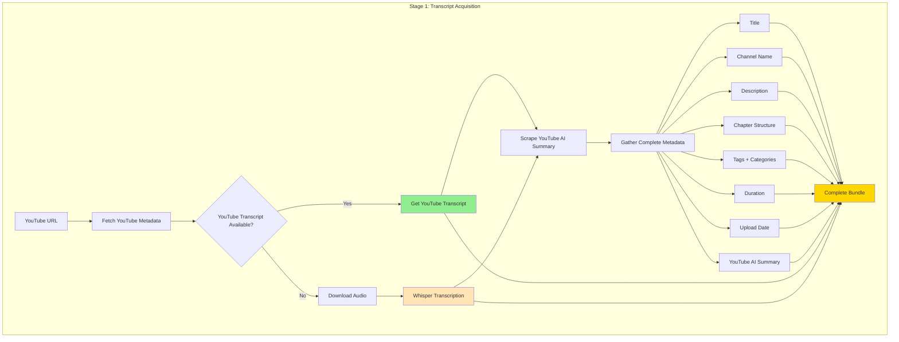

**Transcript Priority:**
1. Try YouTube transcript first (faster, free, no download needed)
2. Only if YouTube transcript unavailable: Download audio + Whisper transcribe
3. Always scrape YouTube AI summary (for Pass 2)

**Outputs:**
- Complete transcript (from YouTube or Whisper)
- YouTube AI summary
- Rich metadata bundle

### Stage 2: Pass 1 - Whole-Document Mining

```mermaid
flowchart TD
    subgraph Pass1 [Pass 1: Whole-Document Mining and Scoring]
        Input1[Inputs] --> Transcript[Full Transcript]
        Input1 --> Metadata[Rich Metadata]
        
        Transcript --> Assemble[Assemble Complete Document]
        Metadata --> Assemble
        
        Assemble --> Format[Format with Timestamps]
        Format --> Context[Add Metadata Context]
        Context --> Prompt[Build Single Comprehensive Prompt]
        
        Prompt --> Check[Simple Token Sanity Check]
        Check -->|Too Large| Error1[Return Error]
        Check -->|OK| API1[Single API Call to Flagship Model]
        
        API1 -->|Retry 1| Attempt1[Process Request]
        Attempt1 -->|Fail| Wait1[Wait 2s]
        Wait1 --> Attempt2[Retry 2]
        Attempt2 -->|Fail| Wait2[Wait 4s]
        Wait2 --> Attempt3[Retry 3]
        Attempt3 -->|Fail| Error2[Return Error + Move to Next URL]
        
        Attempt1 -->|Success| Parse[Parse JSON Response]
        Attempt2 -->|Success| Parse
        Attempt3 -->|Success| Parse
        
        Parse --> Validate[Validate Structure]
        Validate --> Repair[Repair Common Issues]
        Repair --> Output1[Ranked Claims + Entities]
    end
    
    style API1 fill:#87CEEB
    style Error1 fill:#FFB6C6
    style Error2 fill:#FFB6C6
    style Output1 fill:#FFD700
```

**What Pass 1 Does:**

**Extraction Tasks:**
- Extract all significant claims from entire transcript
- Identify jargon terms with definitions
- Identify people mentioned
- Extract mental models and frameworks
- Propose which claims/entities should be rejected (trivial, redundant, unsupported)
- All extractions marked as "pending_review" for user curation

**Speaker Inference Tasks** (YouTube has no diarization):
- Infer speaker for each claim from context clues
- Use metadata (channel name, title, description)
- Assign confidence rating (0-10)
- Provide rationale explaining the attribution
- Flag low-confidence attributions for user review

**Scoring Tasks:**
- Score each claim on 6 dimensions (epistemic value, actionability, novelty, verifiability, understandability, temporal stability)
- Calculate composite importance score (0-10 absolute scale)
- No tiers or ranking (importance score is sufficient for global queries)

**Rejection Proposals:**
- System proposes which claims should be rejected (trivial, redundant, unsupported)
- System proposes which jargon/people/concepts should be rejected
- User has final decision (can accept, reject, or promote rejected items)
- All entities stored in database regardless of status

**Quality Focus:**
- Capture complete multi-step arguments
- Preserve argument structure across conversation
- Identify subtle distinctions between concepts
- Extract implicit mental models
- Maintain rhetorical flow

**Error Handling:**
- 3 automatic retry attempts with exponential backoff
- If all fail: Return error structure
- Log failure details
- Notify user
- Move to next URL

### Stage 3: Pass 2 - World-Class Long Summary

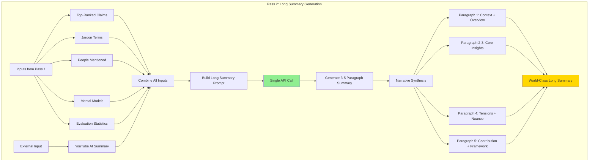

**What Pass 2 Does:**

**Synthesis Tasks:**
- Integrate top-ranked claims into coherent narrative
- Organize by theme (not sequential listing)
- Show how claims relate to each other
- Identify tensions and contradictions
- Highlight mental models and frameworks
- Weave in jargon definitions naturally
- Reference key people and their contributions

**Integration Tasks:**
- Compare with YouTube AI summary
- Note differences in emphasis
- Integrate both perspectives
- Ground narrative in hard claims from Pass 1

**Output: Single World-Class Long Summary**
- Paragraph 1: Context and overview
- Paragraphs 2-3: Core insights organized thematically
- Paragraph 4: Tensions, contradictions, nuance
- Paragraph 5: Intellectual contribution, frameworks, key thinkers

**Style:**
- Sophisticated analytical prose
- Not just claim listing
- Makes connections explicit
- Objective but interpretive
- Integrates all entity types (claims, jargon, people, concepts)

## Data Flow Detail

### Pass 1 Input Assembly

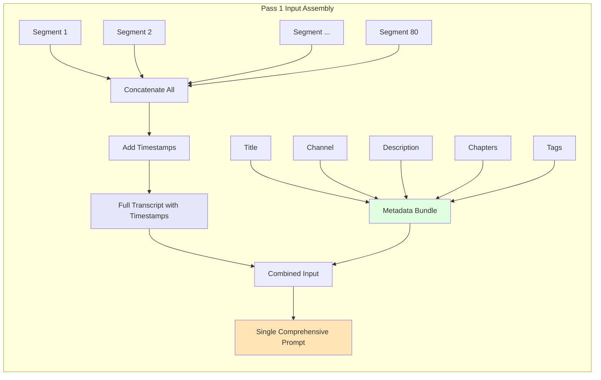

### Pass 1 Output Structure (All Entity Types)

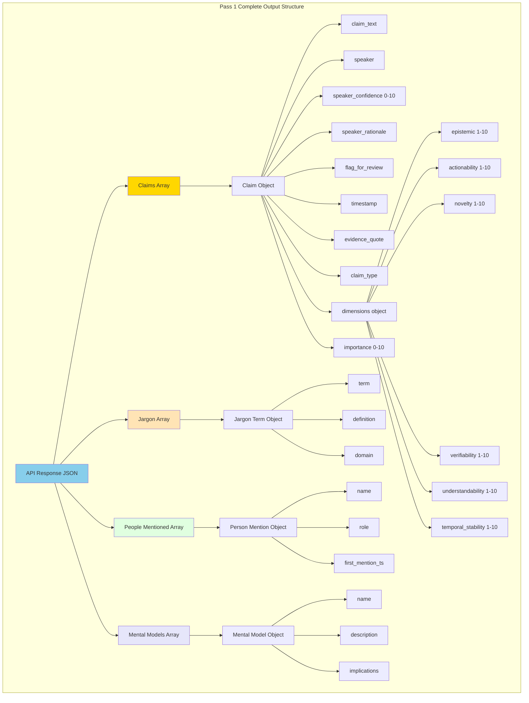

**Complete Entity Extraction:**
- Claims: Scored on 6 dimensions with absolute importance (0-10), speaker inference included
- Jargon: Technical terms with definitions and domain
- People: Individuals mentioned with roles
- Mental Models: Conceptual frameworks with implications

**No Tiers or Ranking:**
- Importance score (0-10) is absolute, not relative to episode
- Claims can be compared globally across all episodes
- Query by importance threshold (e.g., importance >= 8.0)
- Future algorithm refinement possible without reprocessing

### Pass 2 Input Assembly

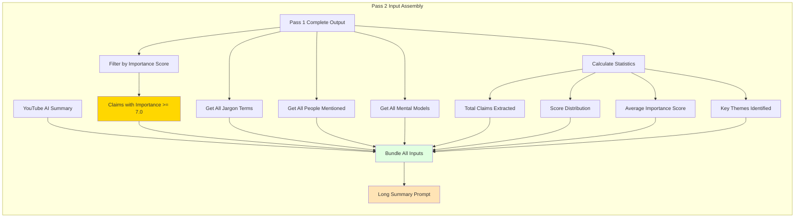

**Pass 2 Inputs:**
- High-importance claims (importance >= 7.0, not ranked within episode)
- All jargon terms with definitions
- All people mentioned with roles
- All mental models with implications
- Evaluation statistics (total claims, score distribution, themes)
- YouTube AI summary (for comparison and integration)

**Note:** No tiers or episode-level ranking. Claims are globally comparable by absolute importance score.

## Error Handling Strategy

```mermaid
flowchart TD
    subgraph ErrorFlow [Error Handling Flow]
        Start[Start Processing URL] --> TokenCheck{Token Sanity Check}
        
        TokenCheck -->|Too Large| LogSize[Log: Content Exceeds Limit]
        TokenCheck -->|OK| Attempt1[API Attempt 1]
        
        Attempt1 -->|Success| ValidateResp{Response Valid?}
        Attempt1 -->|Network Error| Wait1[Wait 2 seconds]
        Attempt1 -->|API Error| Wait1
        
        Wait1 --> Attempt2[API Attempt 2]
        Attempt2 -->|Success| ValidateResp
        Attempt2 -->|Error| Wait2[Wait 4 seconds]
        
        Wait2 --> Attempt3[API Attempt 3]
        Attempt3 -->|Success| ValidateResp
        Attempt3 -->|Error| LogFail[Log: Mining Failed After 3 Attempts]
        
        ValidateResp -->|Valid| RepairMinor[Repair Minor Issues]
        ValidateResp -->|Invalid Structure| LogBad[Log: Malformed Response]
        
        LogSize --> CreateError[Create Error Output]
        LogFail --> CreateError
        LogBad --> CreateError
        
        CreateError --> NotifyUser[Show Error in GUI]
        NotifyUser --> RecordDB[Record Failure in Database]
        RecordDB --> NextURL[Move to Next URL]
        
        RepairMinor --> Success[Return Valid Claims]
    end
    
    style Success fill:#90EE90
    style CreateError fill:#FFB6C6
    style NextURL fill:#87CEEB
```

**Error Handling Principles:**
- Never crash the entire batch
- Always provide user feedback
- Log all failures for debugging
- Move to next URL automatically
- Allow user to retry failed URLs later

## Speaker Inference Strategy

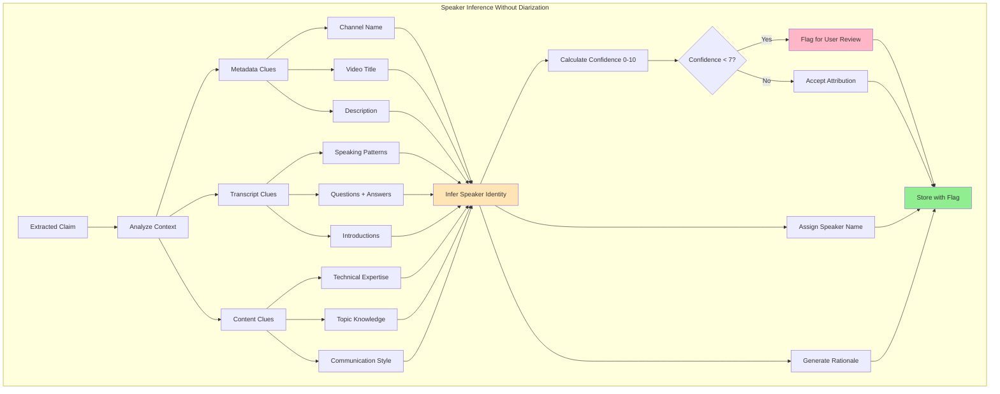

**Speaker Inference Logic:**

**Metadata Clues:**
- Channel name often indicates primary speaker
- Title may mention guests or speakers
- Description may list participants

**Transcript Clues:**
- "Host: Welcome, today we have..." (explicit introduction)
- Question-answer patterns (host asks, guest answers)
- Speaking patterns (technical vs conversational)

**Content Clues:**
- Technical depth indicates expertise
- Topic knowledge suggests speaker identity
- Communication style (academic vs casual)

**Confidence Scoring:**
- 9-10: Explicit introduction or clear context
- 7-8: Strong circumstantial evidence
- 5-6: Reasonable inference, some uncertainty
- 3-4: Weak inference, multiple possibilities
- 0-2: Cannot determine, pure guess

**Rationale Examples:**
- "Channel is 'Eurodollar University' (Snider's podcast), claim shows credit analyst expertise"
- "Host asks 'Jeff, can you explain?' at [12:30], followed by this technical claim"
- "Unknown - no clear speaker indicators in transcript or metadata"

## Quality Preservation Mechanisms

### Multi-Step Argument Capture

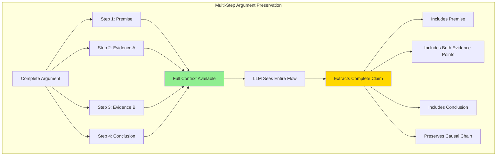

**Example:**
- Segmented approach would extract 4 separate claims
- Whole-document extracts 1 complete claim with full reasoning chain
- Preserves "Premise → Evidence A → Evidence B → Conclusion" structure

### Subtle Distinction Detection

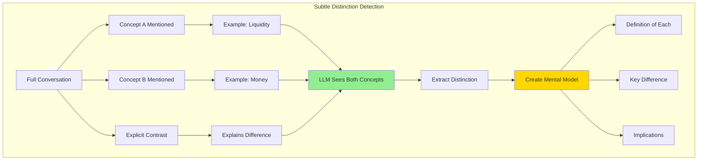

**Example:**
- Speaker explains "liquidity vs money" distinction over 2 minutes
- Whole-document captures complete distinction with implications
- Segmented approach might miss the connection

## Token Sanity Check Logic

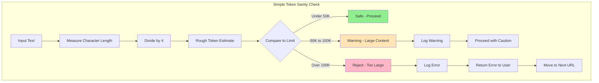

**Why Simple is Better:**
- No dependency on provider-specific libraries
- Fast calculation
- Good enough to catch 3000-page PDFs
- 20-30% margin of error is acceptable

## Database Storage Flow

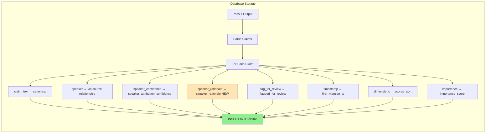

**New Database Field:**
- Only one new column needed: `speaker_rationale TEXT`
- All other fields already exist in schema

**Removed Fields:**
- `tier` column no longer used (importance score is sufficient)
- No episode-level ranking stored (global ranking done at query time)

## Quality Testing Strategy

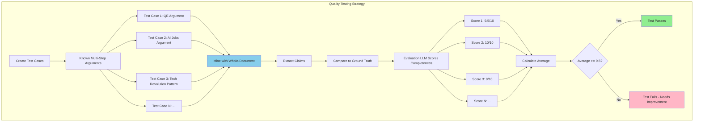

**Testing Methodology:**
- Create 10-20 test cases with known complete arguments
- Process with whole-document mining
- Use separate LLM to evaluate completeness
- Success criteria: Average score ≥ 9.5/10 (95% intact)

## User Experience Flow

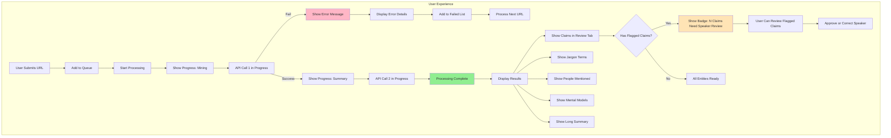

**User Feedback:**
- Real-time progress updates
- Clear error messages if mining fails
- All entity types displayed (claims, jargon, people, mental models)
- Badge showing claims needing speaker review
- Ability to correct speaker attributions
- Long summary displayed with all entities integrated
- Failed URLs logged for later retry

## User Curation Workflow

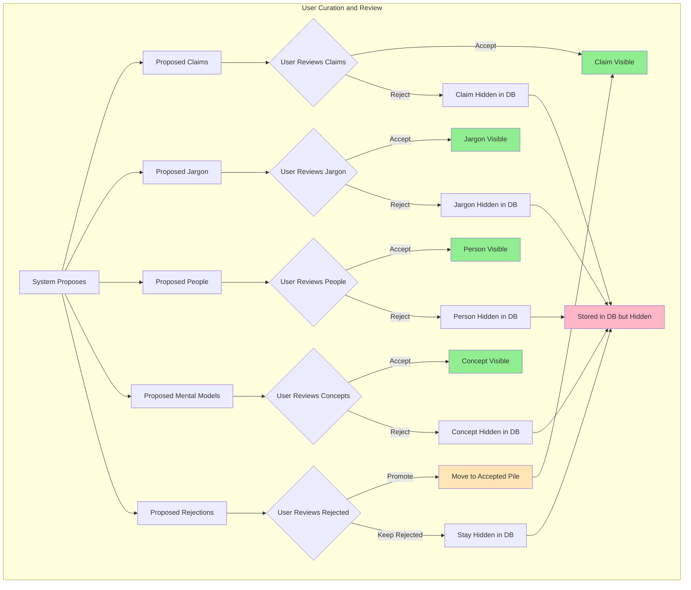

**User Curation Powers:**

**For Accepted Entities (Proposed by System):**
- Accept claim → Remains visible
- Reject claim → Hidden in database, not deleted
- Accept jargon → Remains visible
- Reject jargon → Hidden in database
- Accept person → Remains visible
- Reject person → Hidden in database
- Accept mental model → Remains visible
- Reject mental model → Hidden in database

**For Rejected Entities (Proposed Rejections by System):**
- Promote claim → Move from rejected pile to accepted pile
- Keep rejected → Stays hidden in database

**Database Behavior:**
- Rejected entities are NOT deleted
- They remain in database with hidden/rejected status
- User can always promote rejected claims later
- Provides audit trail of all extractions

**Status Field Values:**
- `accepted` - Visible to user, included in queries
- `rejected` - Hidden from user, excluded from queries
- `pending_review` - Awaiting user decision

## Complete Two-Pass Workflow

### Overview of Both Passes

**Pass 1: Extract Everything**
- Input: Full transcript + rich metadata
- Processing: Extract claims, jargon, people, mental models + score on 6 dimensions + calculate absolute importance + infer speakers + propose rejections
- Output: Complete structured knowledge with all entities (no tiers, no episode-level ranking)
- Status: All entities marked as "pending_review" for user curation
- Time: 30-60 seconds
- Model: Flagship (Gemini 2.0 Flash, GPT-4o, or Claude Sonnet 4.5)

**Pass 2: Synthesize Summary**
- Input: High-importance claims (importance >= 7.0) + all entities + YouTube AI summary
- Processing: Generate world-class long summary
- Output: 3-5 paragraph narrative synthesis
- Time: 20-30 seconds
- Model: Same flagship model

**Total per URL: 2 API calls, 50-90 seconds**

**Key Design Decision:**
- Importance scores are absolute (0-10), not relative to episode
- Claims are globally comparable across all episodes
- No tiers (A/B/C) - just query by importance threshold
- Future algorithm refinement possible without reprocessing

## Implementation Components

### Component 1: Simple Token Sanity Check

**Purpose**: Prevent sending grossly oversized content (like 3000-page PDFs)

**Method**: 
- Rough estimation: character count divided by 4
- No provider-specific tokenizers needed
- Conservative limit: 100,000 tokens

**Thresholds:**
- Under 50K tokens: Safe, proceed
- 50K-100K tokens: Warning, proceed with caution
- Over 100K tokens: Reject, return error

**Why Simple:**
- Works for all models (no dependencies)
- Fast calculation
- Catches obvious problems
- 20-30% margin of error is acceptable

### Component 2: Pass 1 Mining Prompt (Single Comprehensive Prompt)

**Purpose**: Extract and score ALL entities in one API call

**Prompt Structure:**

**Section 1: Metadata Context**
- Video title
- Channel name (primary speaker clue)
- Duration
- Upload date
- Description (first 500 chars)
- Categories and tags (domain context)
- Chapter structure with timestamps (topic flow)

**Section 2: Full Transcript**
- Complete transcript with timestamps
- Format: [MM:SS] Text content
- All segments concatenated (no segmentation)
- Preserves complete conversation flow
- Maintains temporal sequence

**Section 3: Extraction Instructions**

**Claims:**
- Extract all significant claims
- Capture complete multi-step arguments (don't fragment)
- Preserve rhetorical structure
- Note subtle distinctions between concepts
- Include evidence quotes with timestamps

**Jargon:**
- Identify technical terms
- Provide clear definitions
- Assign domain (economics, physics, etc.)
- Note first mention timestamp

**People:**
- Identify all people mentioned
- Distinguish speakers from mentioned individuals
- Note roles and expertise
- Include first mention timestamp

**Mental Models:**
- Extract conceptual frameworks
- Provide descriptions
- Note implications
- Identify when model is introduced

**Section 4: Speaker Inference Instructions**

**Critical Context:**
- YouTube transcripts have NO speaker labels
- Must infer speakers from context clues

**Inference Sources:**
- Channel name (often indicates primary speaker)
- Video title (may mention guests)
- Description (may list participants)
- Conversation patterns (questions/answers)
- Technical expertise level
- Topic knowledge depth

**Required for Each Claim:**
- speaker: Inferred name or "Unknown Speaker"
- speaker_confidence: 0-10 scale
- speaker_rationale: Explanation of attribution
- flag_for_review: true if confidence < 7

**Section 5: Scoring Instructions**

**6-Dimension Scoring (1-10 each):**
- epistemic: Reduces uncertainty about how world works
- actionability: Enables concrete decisions
- novelty: Surprisingness vs common knowledge
- verifiability: Strength of evidence
- understandability: Clarity and accessibility
- temporal_stability: How long will this remain true

**Composite Scoring:**
- Calculate importance from dimensions (0-10 absolute scale)
- No tiers (A/B/C) - importance score is sufficient
- No episode-level ranking - claims ranked globally by importance
- Future algorithm refinement possible (weighted dimensions, ML models, etc.)

**Section 6: Output Format**
- Structured JSON with 4 arrays: claims, jargon, people, mental_models
- Each claim has: text, speaker (with confidence and rationale), timestamp, evidence, 6 dimension scores, absolute importance score (0-10)
- No tiers or episode-level ranking
- All entities with timestamps
- Ready for database storage and global querying

### Component 3: Pass 2 Long Summary Prompt (Single Summary Generation)

**Purpose**: Generate world-class long summary grounded in claims and all entities

**Inputs Required:**

**From Pass 1:**
- High-importance claims (importance >= 7.0, typically 10-15 claims)
- All jargon terms with definitions and domains
- All people mentioned with roles and context
- All mental models with descriptions and implications
- Evaluation statistics (total claims, score distribution, average importance, key themes)

**External Sources:**
- YouTube AI summary (scraped in Stage 1)

**Output: Single World-Class Long Summary**

**Structure (3-5 Paragraphs):**
- Paragraph 1: Context and overview (sets the intellectual landscape)
- Paragraphs 2-3: Core insights organized thematically (not sequentially)
- Paragraph 4: Tensions, contradictions, and nuance
- Paragraph 5: Intellectual contribution, frameworks, key thinkers

**Content Integration:**
- Weaves top claims into narrative
- Defines jargon terms naturally in context
- References people and their contributions
- Explains mental models and their implications
- Compares with YouTube AI summary
- Shows relationships between ideas

**Style:**
- Sophisticated analytical prose
- Narrative synthesis (not bullet points or claim listing)
- Makes connections between ideas explicit
- Objective but interpretive
- Grounded in hard claims from Pass 1

**Why Pass 2 is Necessary:**
- Requires high-importance claims (don't exist until Pass 1 scores them)
- Needs complete entity extraction (jargon, people, concepts from Pass 1)
- Needs evaluation statistics (score distribution, themes)
- Synthesizes narrative from filtered results
- Cannot be done in Pass 1 because claims haven't been scored yet

### Component 4: Output Validation and Repair

**Purpose**: Ensure response structure is valid and repair common issues

**Validation Checks:**

**Structure:**
- JSON is valid
- Required arrays present (claims, jargon, people, mental_models)
- Each claim has required fields

**Claim Fields:**
- claim_text exists and non-empty
- speaker exists (or set to "Unknown Speaker")
- speaker_confidence is 0-10
- timestamp is valid format (MM:SS or HH:MM:SS)
- dimensions object has all 6 scores
- scores are 1-10 range

**Repair Actions:**

**Missing Fields:**
- Add defaults (speaker="Unknown Speaker", confidence=0)
- Calculate missing scores from other dimensions
- Set default timestamps

**Invalid Values:**
- Clamp scores to valid ranges (1-10)
- Fix malformed timestamps
- Normalize speaker names

**Auto-Flagging:**
- Flag claims with speaker_confidence < 7
- Flag claims with missing evidence
- Flag claims with invalid timestamps

### Component 5: Database Schema Addition

**New Field:**
- `speaker_rationale TEXT` in claims table

**Purpose:**
- Store LLM's explanation of speaker attribution
- Helps user verify correctness
- Debugging tool for incorrect attributions

**Example Values:**
- "Channel is 'Eurodollar University' (Snider's podcast), technical depth matches credit analyst expertise"
- "Host asks 'Jeff, can you explain?' at [12:30], followed by this claim"
- "Unknown - no clear speaker indicators in transcript or metadata"

**Existing Fields (Already in Schema):**
- `speaker_attribution_confidence` (0-10 scale)
- `flagged_for_review` (boolean)
- `importance_score` (0-10 absolute scale)
- `scores_json` (stores 6 dimension scores)
- All other claim fields

**Deprecated Fields:**
- `tier` (no longer used - importance score is sufficient)

**User Curation Fields:**
- `user_status` - 'accepted', 'rejected', 'pending_review'
- `user_notes` - User comments on the entity
- `reviewed_by` - Who reviewed it
- `reviewed_at` - When reviewed

**Global Querying:**
- Get top claims globally: `WHERE user_status='accepted' ORDER BY importance_score DESC`
- Get high-importance claims: `WHERE user_status='accepted' AND importance_score >= 8.0`
- Get rejected claims: `WHERE user_status='rejected'` (hidden but not deleted)
- Promote rejected claim: `UPDATE claims SET user_status='accepted' WHERE claim_id=?`

## Cost and Performance Summary

### Per URL (1 Hour Podcast)

**API Calls:**
- Pass 1: Mining + scoring (30-60 seconds)
- Pass 2: Executive summary (20-30 seconds)
- Total: 2 API calls, 50-90 seconds

**Cost per URL:**
- Gemini 2.0 Flash: $0.00-$0.004
- GPT-4o: $0.08-$0.12
- Claude Sonnet 4.5: $0.12-$0.16

### For 5,000 Hours

| Model | Pass 1 Cost | Pass 2 Cost | Total Cost | Quality |
|-------|-------------|-------------|------------|---------|
| Gemini 2.0 Flash | $0-$13 | $0-$5 | $0-$18 | Excellent |
| GPT-4o | $421 | $150 | $571 | Excellent |
| Claude Sonnet 4.5 | $581 | $200 | $781 | Best |

**Recommendation**: Gemini 2.0 Flash
- Free during preview period
- Excellent quality
- 1M token context window
- Fast processing

## Success Metrics

### Quality Metrics
- Multi-step arguments: 95%+ complete (≥9.5/10 automated evaluation)
- Speaker inference: 80%+ correct, 90%+ of errors flagged
- Subtle distinctions: Captured in mental models
- Long summary: Grounded in hard claims, narrative synthesis
- Importance scoring: Absolute scale allows global comparison across episodes

### Performance Metrics
- Processing: <90 seconds per hour of content
- Success rate: >95% (graceful failure for rest)
- Cost: $0-$0.15 per hour

### User Experience Metrics
- Clear error messages for failures
- Badge showing claims needing speaker review
- Ability to correct attributions
- Failed URLs available for retry

## Files to Modify

1. `src/knowledge_system/utils/text_utils.py` - Simple token sanity check
2. `src/knowledge_system/processors/hce/unified_miner.py` - Whole-document mining method
3. `src/knowledge_system/processors/hce/unified_pipeline.py` - Two-pass integration
4. `src/knowledge_system/processors/hce/schema_validator.py` - Validation and repair
5. `src/knowledge_system/database/migrations/2025_12_22_speaker_inference.sql` - Add speaker_rationale
6. `config/settings.yaml` - Configuration
7. `src/knowledge_system/gui/tabs/summarization_tab.py` - Error display
8. `tests/test_whole_document_quality.py` - Quality testing

## Implementation Tasks

1. Add simple token sanity check (no provider-specific tokenizers)
2. Implement whole-document mining method with speaker inference
3. Build comprehensive single prompt with all instructions
4. Add output validation and repair logic
5. Create database migration for speaker_rationale field
6. Update pipeline to use two-pass whole-document approach
7. Add error handling and user feedback in GUI
8. Create quality tests with automated LLM evaluation
9. Add configuration for model selection and thresholds
10. Document speaker inference approach and quality metrics

## Why This Works for Both Cloud and Local

**Cloud APIs (Anthropic, OpenAI, Google):**
- Large context windows (128K-200K tokens)
- Single call faster than multiple (reduces latency)
- Better quality (full context)

**Local Ollama:**
- Modern models have 32K-128K context
- Single call more GPU efficient (no context switching)
- Better KV cache utilization
- Actually faster than parallel segments

**Universal Benefits:**
- No claim fragmentation
- Complete argument preservation
- Simpler architecture
- Better quality

