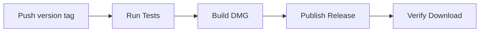

# Daemon Release Process

**Last Updated:** January 11, 2026  
**Current Version:** 1.1.1

---

## Overview

The GetReceipts daemon (formerly "Skip the Podcast Desktop") is released as a **DMG installer** to the public repository at `https://github.com/msg43/Skipthepodcast.com`. 

**Architecture Change (January 2026):**
- ❌ **Old:** Desktop app with GUI (PyQt6) - **DEPRECATED**
- ✅ **New:** Background daemon controlled via GetReceipts.org web interface

The daemon is the only component users need. All interaction happens through the web browser.

---

## Version Management

### Single Version Number (Daemon Version)

**As of January 2026**, there is only **one version number** that matters:

**Daemon Version** (in `daemon/__init__.py`): **1.1.1**
- The background service/API
- Used for GitHub release tags (e.g., v1.1.0)
- Used for DMG filenames
- Reported by daemon's `/health` endpoint
- Used by auto-update checker

### Version Location

```
daemon/__init__.py
```

```python
__version__ = "1.1.1"
```

### Legacy Application Version (DEPRECATED)

The old `pyproject.toml` version (4.1.0) is **deprecated** and no longer used:
```toml
[project]
version = "4.1.0"  # LEGACY - No longer used for releases
```

This was for the old desktop GUI app which has been replaced by the web-controlled daemon.

### Release Naming

GitHub releases now use the **daemon version**:
- Release tag: `v1.1.1`
- DMG filename: `Skip_the_Podcast_Desktop-1.1.1.dmg`
- Release title: "GetReceipts Daemon v1.1.1"

---

## Release Workflow

### Automated Release (Recommended)

**GitHub Actions automatically builds and publishes releases when you push a version tag:**

```bash
# 1. Update daemon version
# Edit daemon/__init__.py
__version__ = "1.1.2"  # Increment version

# 2. Commit changes
git add daemon/__init__.py CHANGELOG.md
git commit -m "Release daemon v1.1.2"

# 3. Create and push tag
git tag v1.1.2
git push origin main
git push origin v1.1.2

# 4. GitHub Actions automatically:
#    - Runs daemon tests
#    - Builds DMG (271MB, minimal deps)
#    - Publishes to Skipthepodcast.com
#    - Verifies download URL works
```

**Monitor progress:** https://github.com/msg43/Knowledge_Chipper/actions

### Manual Release (Backup)

If automation fails or you need manual control:

#### Step 1: Update Daemon Version

```bash
# Edit daemon/__init__.py
__version__ = "1.1.2"  # Increment version (semantic versioning)
```

**Semantic Versioning:**
- **Major** (1.x.x): Breaking API changes
- **Minor** (x.1.x): New features, backwards compatible
- **Patch** (x.x.1): Bug fixes

#### Step 2: Build the DMG

Build the DMG installer using the build script:

```bash
cd /Users/matthewgreer/Projects/Knowledge_Chipper
bash scripts/build_macos_app.sh --make-dmg --skip-install
```

This creates:
```
dist/Skip_the_Podcast_Desktop-{VERSION}.dmg
```

### Step 3: Publish to GitHub

Use the publish script to release to the public repository:

```bash
bash scripts/publish_release.sh
```

This script:
1. ✅ Reads **daemon version** from `daemon/__init__.py` (e.g., 1.1.1)
2. ✅ Checks if DMG exists for that version
3. ✅ Builds DMG if needed
4. ✅ Creates a git tag in the public repo (e.g., v1.1.1)
5. ✅ Creates a GitHub release titled "GetReceipts Daemon v1.1.1"
6. ✅ Uploads versioned DMG: `Skip_the_Podcast_Desktop-1.1.1.dmg`

#### Step 4: Verify Release

Check the release page:
```
https://github.com/msg43/Skipthepodcast.com/releases/latest
```

Verify:
- ✅ DMG file present: `Skip_the_Podcast_Desktop-1.1.2.dmg`
- ✅ Release title: "GetReceipts Daemon v1.1.2" (not "Skip the Podcast v4.x")
- ✅ Download URL works (buttons use dynamic detection)

---

## GitHub Actions Automation

### Overview

The daemon release process is **fully automated** via GitHub Actions. When you push a version tag, it automatically tests, builds, and publishes the release.

### Workflow File

[`.github/workflows/daemon-release.yml`](.github/workflows/daemon-release.yml)

### How It Works



**Jobs:**
1. **Test** (Ubuntu) - Run daemon API tests (~30 seconds)
2. **Build** (macOS) - Create DMG with minimal deps (~10 minutes)
3. **Publish** (macOS) - Upload to Skipthepodcast.com (~1 minute)

### Using Automation

```bash
# 1. Update version
vim daemon/__init__.py  # Change __version__ = "1.1.2"

# 2. Update CHANGELOG.md
vim CHANGELOG.md  # Add release notes

# 3. Commit and tag
git add daemon/__init__.py CHANGELOG.md
git commit -m "Release daemon v1.1.2"
git tag v1.1.2
git push origin main
git push origin v1.1.2

# 4. Monitor progress
open https://github.com/msg43/Knowledge_Chipper/actions

# 5. Verify release
open https://github.com/msg43/Skipthepodcast.com/releases/latest
```

### What Gets Tested

**Daemon-specific tests only** (no false failures):
- ✅ Health endpoint (`/health`)
- ✅ Process endpoint (`/process`)
- ✅ Jobs endpoint (`/jobs`)
- ✅ Config endpoint (`/config`)
- ✅ Daemon imports and initialization

**NOT tested** (avoid false failures):
- ❌ GUI tests (deprecated)
- ❌ HCE tests (not used)
- ❌ Diarization tests (not used)
- ❌ Heavy ML tests (models download on-demand)

### Manual Testing

Test locally before pushing tag:

```bash
# Run daemon tests
make test-daemon

# Build DMG locally
bash scripts/build_macos_app.sh --clean --make-dmg --skip-install

# Verify everything works before tagging
```

### Troubleshooting Automation

**If workflow fails:**
1. Check Actions tab: https://github.com/msg43/Knowledge_Chipper/actions
2. Review error logs
3. Fix issue and create new tag (e.g., v1.1.3)
4. Or use manual release as backup

**Manual workflow trigger:**
- Go to Actions tab
- Select "Daemon Release" workflow
- Click "Run workflow"
- Useful for testing without creating tags

---

## Download URLs

### Stable URL (Always Latest)

This URL always points to the latest release:
```
https://github.com/msg43/Skipthepodcast.com/releases/latest/download/Skip_the_Podcast_Desktop.dmg
```

**Used by:**
- GetReceipts.org download buttons
- Daemon auto-update system
- Installation scripts

### Versioned URL

For specific versions:
```
https://github.com/msg43/Skipthepodcast.com/releases/download/v1.0.0/Skip_the_Podcast_Desktop-1.0.0.dmg
```

---

## GetReceipts.org Integration

All download links on GetReceipts.org use the **stable DMG URL**:

### Updated Files (January 11, 2026)

1. **`src/components/daemon-status-indicator.tsx`**
   ```typescript
   window.location.href = "https://github.com/msg43/Skipthepodcast.com/releases/latest/download/Skip_the_Podcast_Desktop.dmg";
   ```

2. **`src/components/daemon-installer.tsx`**
   ```typescript
   window.location.href = "https://github.com/msg43/Skipthepodcast.com/releases/latest/download/Skip_the_Podcast_Desktop.dmg";
   ```

3. **`src/app/api/download/generate-link-token/route.ts`**
   ```typescript
   const downloadUrl = `https://github.com/msg43/Skipthepodcast.com/releases/latest/download/Skip_the_Podcast_Desktop.dmg?link_token=${token}`;
   ```

4. **`src/components/settings-form.tsx`**
   ```typescript
   window.open("https://github.com/msg43/Skipthepodcast.com/releases/latest", "_blank");
   ```

---

## Why DMG Instead of PKG?

**Historical Context:**

We initially used PKG installers but encountered notarization issues that were resolved for DMG but persisted for PKG. Therefore, we switched to DMG as the primary distribution format.

**Benefits of DMG:**
- ✅ Simpler installation (drag-and-drop)
- ✅ No notarization issues
- ✅ Better user experience
- ✅ Easier to verify contents before installation

---

## Auto-Update System

The daemon includes an auto-update system that checks for new releases automatically.

### When Updates Are Checked

The daemon checks for updates in two scenarios:
1. **On Startup** - Every time the daemon starts or restarts
2. **Every 24 Hours** - While running, checks periodically

### How It Works

1. **Check for Updates**
   - Daemon queries GitHub releases API
   - Compares current version with latest release

2. **Download Update**
   - Downloads `Skip_the_Podcast_Desktop.dmg` from stable URL
   - Verifies integrity

3. **Install Update**
   - Extracts app from DMG
   - Replaces current installation
   - LaunchAgent automatically restarts daemon

### Configuration

Auto-update settings in daemon:
```python
# daemon/services/update_checker.py
CHECK_INTERVAL_HOURS = 24  # Check every 24 hours
GITHUB_REPO = "msg43/Knowledge_Chipper"  # Checks releases here
```

---

## How to Restart the Daemon

### Method 1: Desktop Shortcut (Easiest)

Double-click the **"GetReceipts Daemon"** icon on your desktop:
- Shows current status (running/stopped)
- Offers to Start/Restart/Stop
- Shows notifications
- No terminal required!

**Location:** `~/Desktop/GetReceipts Daemon.app`

### Method 2: Web Button (Convenient)

Visit GetReceipts.org/contribute/settings and click **"Restart Daemon"** button:
- Restarts daemon remotely
- Checks for updates immediately
- Works from any browser

### Method 3: Terminal Command

```bash
# Restart the daemon
launchctl stop org.skipthepodcast.daemon
launchctl start org.skipthepodcast.daemon
```

Or use the convenience scripts:

```bash
# Stop daemon
/Applications/Skip\ the\ Podcast\ Desktop.app/Contents/Resources/bin/stop-daemon.sh

# Start daemon
/Applications/Skip\ the\ Podcast\ Desktop.app/Contents/Resources/bin/start-daemon.sh

# Check status
/Applications/Skip\ the\ Podcast\ Desktop.app/Contents/Resources/bin/daemon-status.sh
```

### Method 4: Restart macOS

The daemon will automatically start when you log back in (if configured to run at load).

### Why Restart?

Restarting the daemon will:
- ✅ Check for updates immediately (instead of waiting 24 hours)
- ✅ Apply any configuration changes
- ✅ Clear any stuck processes
- ✅ Reload the latest code if manually updated

---

## Troubleshooting

### Issue: Download link returns 404

**Cause:** Release not published or DMG file missing

**Solution:**
1. Check release exists: `https://github.com/msg43/Skipthepodcast.com/releases/latest`
2. Verify both DMG files are uploaded
3. Re-run publish script if needed

### Issue: Version mismatch

**Cause:** Daemon version in `__init__.py` doesn't match release tag

**Solution:**
1. Update `daemon/__init__.py` with correct version
2. Rebuild DMG
3. Re-publish release

### Issue: Old version still downloading

**Cause:** GitHub CDN cache

**Solution:**
- Wait 5-10 minutes for CDN to update
- Use versioned URL for immediate access

---

## Release Checklist

Before publishing a new daemon release:

- [ ] Update version in `daemon/__init__.py` (e.g., 1.1.1)
- [ ] Update CHANGELOG.md with release notes
- [ ] Test daemon locally
- [ ] Run `bash scripts/build_macos_app.sh --make-dmg --skip-install`
- [ ] Verify DMG mounts and app launches
- [ ] Check daemon reports correct version: `curl http://localhost:8765/health`
- [ ] Run `bash scripts/publish_release.sh`
- [ ] Verify release on GitHub:
  - [ ] Tagged as v1.1.1 (daemon version)
  - [ ] Title is "GetReceipts Daemon v1.1.1"
  - [ ] Both DMG files uploaded (versioned + stable)
- [ ] Test download from GetReceipts.org
- [ ] Verify daemon auto-update detects new version

**Note:** Only the daemon version matters now. The old pyproject.toml version (4.1.0) is deprecated.

---

## Quick Reference

### Build DMG
```bash
bash scripts/build_macos_app.sh --make-dmg --skip-install
```

### Publish Release
```bash
bash scripts/publish_release.sh
```

### Check Current Daemon Version
```bash
python3 -c "import sys; sys.path.insert(0, 'daemon'); from daemon import __version__; print(__version__)"
```

### Test Download URL
```bash
curl -I https://github.com/msg43/Skipthepodcast.com/releases/latest/download/Skip_the_Podcast_Desktop.dmg
```

---

## Related Documentation

- `docs/DAEMON_AUTO_UPDATE_IMPLEMENTATION.md` - Auto-update system details
- `CHANGELOG.md` - Version history
- `README.md` - User-facing documentation
- `scripts/publish_release.sh` - Release automation script
