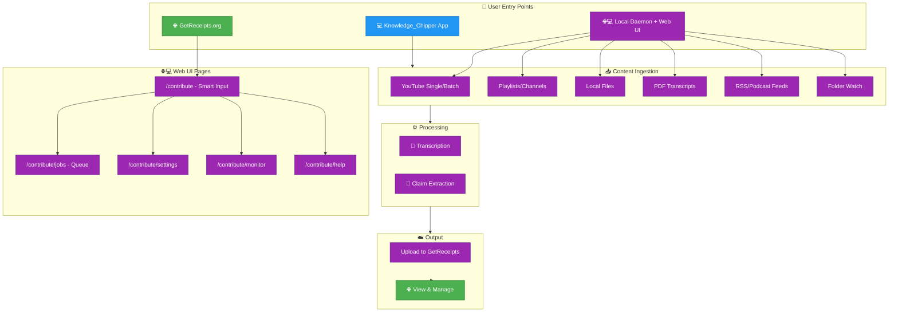
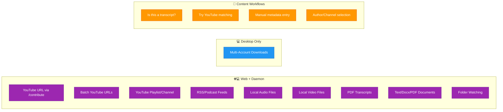
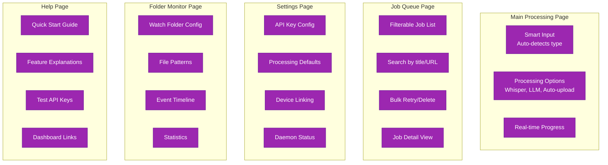
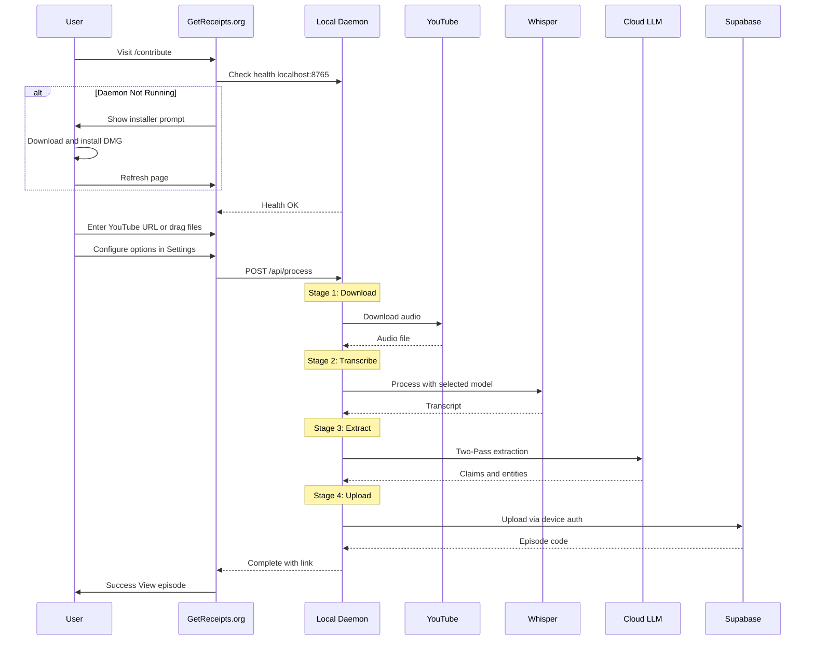

# Knowledge System Feature Flowchart

**GetReceipts.org + Knowledge_Chipper Integration**

*Updated: January 02, 2026 10:30:00 EST - Implemented automatic device linking on first launch*

## Legend

- 🌐 **Web Only** - GetReceipts.org
- 💻 **Desktop Only** - Knowledge_Chipper
- 🌐💻 **Web + Daemon** - GetReceipts.org with local daemon

---

## Complete User Journey Flow

This comprehensive flowchart shows the entire processing pipeline from initial daemon detection through all content ingestion workflows to final upload.

```mermaid
flowchart TD
    START[👤 User visits getreceipts.org/contribute]
    
    START --> CHECK_DAEMON{🔍 Check localhost:8765}
    
    CHECK_DAEMON -->|❌ Not Running| SHOW_INSTALLER[📦 Show Installer Prompt]
    CHECK_DAEMON -->|✅ Running| SHOW_UI[🎯 Show Smart Input UI]
    
    SHOW_INSTALLER --> DOWNLOAD[💾 Download .dmg]
    DOWNLOAD --> INSTALL[⚙️ Install Daemon]
    INSTALL --> AUTO_START[🚀 LaunchAgent Auto-Start]
    AUTO_START --> FIRST_LAUNCH[🎯 First Launch Detection]
    FIRST_LAUNCH --> LINK_CHECK{🔗 Device Linked?}
    LINK_CHECK -->|❌ No| OPEN_AUTH[🌐 Opens Browser<br/>getreceipts.org/auth/signin?device_id=xxx]
    OPEN_AUTH --> USER_AUTH[🔐 User Signs In/Up]
    USER_AUTH --> AUTO_LINK_DEVICE[🔗 Auto-Link Device to User<br/>💾 Save to devices table]
    AUTO_LINK_DEVICE --> POLL_SUCCESS[✅ App Polls & Detects Link]
    POLL_SUCCESS --> SHOW_SUCCESS[🎉 Show Success Notification]
    LINK_CHECK -->|✅ Yes| REFRESH[🔄 Refresh Page]
    SHOW_SUCCESS --> REFRESH
    REFRESH --> CHECK_DAEMON
    
    SHOW_UI --> INPUT[📝 User enters content]
    INPUT --> DETECT_TYPE{🔎 Detect Input Type}
    
    %% YouTube Single/Batch URLs
    DETECT_TYPE -->|🎬 YouTube URL| YT_SINGLE[📋 Fetch YouTube Metadata<br/>💾 Save to SQLite]
    YT_SINGLE --> YT_TRANSCRIPT_TRY{🎤 YouTube Transcript Available?}
    YT_TRANSCRIPT_TRY -->|✅ Yes| YT_TRANSCRIPT[Get YouTube Transcript<br/>💾 Save to SQLite]
    YT_TRANSCRIPT_TRY -->|❌ No| YT_DOWNLOAD[📥 yt-dlp: Download Audio]
    YT_DOWNLOAD --> WHISPER_FALLBACK[🎤 Whisper Transcription<br/>💾 Save to SQLite]
    YT_TRANSCRIPT --> PROCESS_CONTENT
    WHISPER_FALLBACK --> PROCESS_CONTENT
    
    %% YouTube Playlist/Channel
    DETECT_TYPE -->|📺 Playlist/Channel URL| YT_PLAYLIST[Expand Playlist URLs]
    YT_PLAYLIST --> BATCH_JOBS[🔢 Create Batch Jobs]
    BATCH_JOBS --> YT_SINGLE
    
    %% RSS/Podcast Feeds
    DETECT_TYPE -->|📡 RSS Feed URL| RSS_FEED[Fetch RSS Feed]
    RSS_FEED --> RSS_EPISODES[📻 Extract Episodes Max 9999]
    RSS_EPISODES --> BATCH_JOBS
    
    %% Local Audio/Video Files
    DETECT_TYPE -->|🎵 Audio/Video File| LOCAL_FILE[Upload Local File<br/>💾 Save metadata to SQLite]
    LOCAL_FILE --> LOCAL_SEARCH_Q{🔍 Search YouTube?}
    LOCAL_SEARCH_Q -->|✅ Yes| LOCAL_YT_SEARCH[🔎 Search YouTube API]
    LOCAL_SEARCH_Q -->|❌ No| LOCAL_MANUAL[Manual Metadata Entry]
    
    LOCAL_YT_SEARCH --> LOCAL_MATCHES_Q{🎯 Found Matches?}
    LOCAL_MATCHES_Q -->|✅ Yes| LOCAL_SHOW_MATCHES[🖼️ Show Match Dialog]
    LOCAL_MATCHES_Q -->|❌ No| LOCAL_MANUAL
    
    LOCAL_SHOW_MATCHES --> LOCAL_USER_SELECT{👆 User Selection}
    LOCAL_USER_SELECT -->|✅ Select Match| LOCAL_FETCH_META[📋 Fetch YouTube Metadata<br/>💾 Save to SQLite]
    LOCAL_USER_SELECT -->|❌ None Match| LOCAL_MANUAL
    
    LOCAL_FETCH_META --> TRANSCRIBE
    LOCAL_MANUAL --> TRANSCRIBE[🎤 Whisper Transcription<br/>💾 Save to SQLite]
    
    %% Text/DOCX/PDF Documents
    DETECT_TYPE -->|📄 Text/DOCX/PDF| DOC_UPLOAD[Read File Content]
    DOC_UPLOAD --> TRANSCRIPT_Q{📝 Is this a transcript?}
    
    TRANSCRIPT_Q -->|✅ Yes| SEARCH_Q{🔍 Search YouTube?}
    TRANSCRIPT_Q -->|❌ No| SKIP_TO_MANUAL[Manual Metadata Entry]
    
    SEARCH_Q -->|✅ Yes checked| YT_SEARCH[🔎 Search YouTube API]
    SEARCH_Q -->|❌ No default| SKIP_TO_MANUAL
    
    YT_SEARCH --> MATCHES_Q{🎯 Found Matches?}
    MATCHES_Q -->|✅ Yes| SHOW_MATCHES[🖼️ Show Match Dialog]
    MATCHES_Q -->|❌ No| NO_MATCH[No YouTube match]
    
    SHOW_MATCHES --> USER_SELECT{👆 User Selection}
    USER_SELECT -->|✅ Select Match| FETCH_YT_META[📋 Fetch YouTube Metadata<br/>💾 Save to SQLite]
    USER_SELECT -->|❌ None Match| NO_MATCH
    
    NO_MATCH --> MANUAL_META
    SKIP_TO_MANUAL --> MANUAL_META[📝 Manual Metadata Form]
    
    MANUAL_META --> TITLE_INPUT[✏️ Enter Title]
    TITLE_INPUT --> AUTHOR_SELECT{👤 Select Author}
    
    AUTHOR_SELECT -->|📚 Existing| CHOOSE_AUTHOR[Choose from List<br/>💾 Save to SQLite]
    AUTHOR_SELECT -->|➕ Create New| CREATE_AUTHOR[Create New Author<br/>💾 Save to SQLite]
    
    CHOOSE_AUTHOR --> PROCESS_CONTENT
    CREATE_AUTHOR --> PROCESS_CONTENT
    FETCH_YT_META --> PROCESS_CONTENT
    
    %% Processing Pipeline - Two-Pass Detailed
    TRANSCRIBE --> PROCESS_CONTENT[⚙️ Two-Pass Pipeline]
    
    %% Pass 1: Extraction
    PROCESS_CONTENT --> PASS1_START[📋 Pass 1: Extraction]
    PASS1_START --> PASS1_LOAD[Load extraction_pass.txt prompt]
    PASS1_LOAD --> PASS1_BUILD[Build prompt with<br/>complete transcript + metadata]
    PASS1_BUILD --> PASS1_CALL[🔄 Call LLM once]
    PASS1_CALL --> PASS1_PARSE[Parse JSON response]
    PASS1_PARSE --> PASS1_VALIDATE[Validate & repair]
    PASS1_VALIDATE --> PASS1_EXTRACT[Extract all entities:<br/>• Claims with 6D scoring<br/>• Jargon with definitions<br/>• People/organizations<br/>• Mental models<br/>• Speaker inference<br/>• Importance scores 0-10<br/>💾 Save to SQLite]
    
    %% Pass 2: Synthesis
    PASS1_EXTRACT --> PASS2_START[📊 Pass 2: Synthesis]
    PASS2_START --> PASS2_FILTER[Filter high-importance claims ≥7.0]
    PASS2_FILTER --> PASS2_LOAD[Load synthesis_pass.txt prompt]
    PASS2_LOAD --> PASS2_BUILD[Build prompt with all entities<br/>+ YouTube AI summary]
    PASS2_BUILD --> PASS2_CALL[🔄 Call LLM once]
    PASS2_CALL --> PASS2_PARSE[Parse response]
    PASS2_PARSE --> PASS2_SYNTH[Generate synthesis:<br/>• Flexible length 5¶ to 2 pages<br/>• Based on duration + claim density<br/>• Thematic organization<br/>• Key themes + quality metrics<br/>💾 Save to SQLite]
    
    PASS2_SYNTH --> PROCESSING_COMPLETE[✅ Processing Complete<br/>Total: 2 API calls]
    
    %% Upload Flow - Device Already Linked
    PROCESSING_COMPLETE --> CHECK_SETTING{☁️ Auto-Upload<br/>Enabled?}
    CHECK_SETTING -->|✅ Yes default| UPLOAD_GR[🚀 Upload to GetReceipts<br/>Device already linked]
    CHECK_SETTING -->|❌ No disabled| COMPLETE_LOCAL[✅ Saved Locally Only]
    
    UPLOAD_GR --> GR_API[🌐 GetReceipts API<br/>Rate limited 99999/hour]
    GR_API --> AUDIT_LOG[📝 Create Audit Log Entry]
    AUDIT_LOG --> SUPABASE[🗄️ Supabase Database]
    SUPABASE --> SUCCESS[🎉 Upload Successful]
    
    SUCCESS --> VIEW_LINK[🔗 View on GetReceipts.org]
    COMPLETE_LOCAL --> CAN_UPLOAD_LATER[Can upload manually later]
    
    %% Styling
    classDef userAction fill:#4CAF50,stroke:#2E7D32,color:white
    classDef daemon fill:#9C27B0,stroke:#6A1B9A,color:white
    classDef decision fill:#FF9800,stroke:#E65100,color:white
    classDef process fill:#2196F3,stroke:#1565C0,color:white
    classDef success fill:#4CAF50,stroke:#2E7D32,color:white
    classDef warning fill:#f44336,stroke:#c62828,color:white
    
    class START,INPUT,USER_SELECT,LOCAL_USER_SELECT userAction
    class CHECK_DAEMON,DETECT_TYPE,YT_TRANSCRIPT_TRY,TRANSCRIPT_Q,SEARCH_Q,MATCHES_Q,AUTHOR_SELECT,CHECK_SETTING,CHECK_DEVICE_LINK,LOCAL_SEARCH_Q,LOCAL_MATCHES_Q decision
    class YT_DOWNLOAD,YT_META,TRANSCRIBE,PROCESS_CONTENT,EXTRACT,SYNTHESIZE,UPLOAD_GR,WHISPER_FALLBACK process
    class SUCCESS,COMPLETE_LOCAL,YT_TRANSCRIPT,LOCAL_FETCH_META,FETCH_YT_META success
    class SHOW_INSTALLER,NO_MATCH,TRIGGER_LINK warning
```

---

## User Journey Overview

---

## Content Ingestion Options

---

## Web UI Feature Pages (NEW)

---

## Processing Sequence (Web + Daemon)

---

## Feature Availability Matrix

| Feature | 🌐 Web | 💻 Desktop | 🌐💻 Web+Daemon |
|---------|--------|-----------|----------------|
| **Content Ingestion** ||||
| → YouTube Single URL | ❌ | ✅ | ✅ |
| → YouTube Batch URLs | ❌ | ✅ | ✅ |
| → YouTube Playlist/Channel (NEW) | ❌ | ✅ | ✅ |
| → Local Audio/Video Files | ❌ | ✅ | ✅ |
| → PDF Transcripts | ❌ | ✅ | ✅ |
| → Text/Docx/PDF Documents (NEW) | ❌ | ✅ | ✅ |
| → RSS/Podcast Feeds (NEW) | ❌ | ✅ | ✅ |
| → Folder Watching | ❌ | ✅ | ✅ |
| **Content Workflows** ||||
| → Transcript Detection (NEW) | ❌ | ✅ | ✅ |
| → YouTube Video Matching (NEW) | ❌ | ✅ | ✅ |
| → Manual Metadata Entry (NEW) | ❌ | ✅ | ✅ |
| → Author/Channel Selection (NEW) | ❌ | ✅ | ✅ |
| **Transcription** ||||
| → Whisper Transcription | ❌ | ✅ | ✅ |
| → Model Selection (NEW) | ❌ | ✅ | ✅ |
| **Claim Extraction** ||||
| → Cloud LLM (OpenAI, Anthropic) | ❌ | ✅ | ✅ |
| → LLM Provider Selection (NEW) | ❌ | ✅ | ✅ |
| → Local LLM (Ollama) | ❌ | ✅ | ❌ |
| → Custom Prompt Editing | ❌ | ✅ | ❌ |
| **Job Management (NEW)** ||||
| → Job Queue with Filters | ❌ | ✅ | ✅ |
| → Retry Failed Jobs | ❌ | ✅ | ✅ |
| → Cancel Running Jobs | ❌ | ✅ | ✅ |
| → Bulk Actions | ❌ | ✅ | ✅ |
| **Configuration (NEW)** ||||
| → API Key Management | ❌ | ✅ | ✅ |
| → Processing Defaults | ❌ | ✅ | ✅ |
| → Device Linking Status | ✅ | ✅ | ✅ |
| **Upload & Sync** ||||
| → Auto-Upload to GetReceipts | ❌ | ✅ | ✅ |
| → Auto-Upload Toggle (NEW) | ❌ | ✅ | ✅ |
| → Device Authentication | ✅ | ✅ | ✅ |
| **Knowledge Exploration** ||||
| → 3D Knowledge Graph | ✅ | ❌ | ❌ |
| → Debate Arena | ✅ | ❌ | ❌ |
| → Intellectual Portraits | ✅ | ❌ | ❌ |
| → Collections | ✅ | ❌ | ❌ |
| **Claim Management** ||||
| → View/Edit Claims | ✅ | ❌ | ❌ |
| → Change Tier (A/B/C) | ✅ | ❌ | ❌ |
| → Embeddable Cards | ✅ | ❌ | ❌ |
| **Community** ||||
| → Voting (Upvote/Downvote) | ✅ | ❌ | ❌ |
| → Comments | ✅ | ❌ | ❌ |
| → Bookmarks | ✅ | ❌ | ❌ |
| **Moderation** ||||
| → Edit Proposals | ✅ | ❌ | ❌ |
| → Merge Proposals | ✅ | ❌ | ❌ |
| → Trust Levels | ✅ | ❌ | ❌ |

---

## Recently Completed Features (Dec 29, 2025)

| Feature | Description | Status |
|---------|-------------|--------|
| ✅ **YouTube Playlists/Channels** | Auto-expand playlist URLs to individual videos for batch processing | Completed |
| ✅ **RSS/Podcast Feeds** | Process RSS feed URLs to download latest episodes automatically | Completed |
| ✅ **Document Upload Workflow** | Upload text/docx/PDF documents (not just transcripts) for direct claim extraction | Completed |
| ✅ **Transcript Detection** | Toggle to mark uploaded content as transcripts for YouTube matching | Completed |
| ✅ **YouTube Video Matching** | Search YouTube API for matching videos when processing transcripts (opt-in) | Completed |
| ✅ **Manual Metadata Entry** | Manual entry of title, author, date when no YouTube match found | Completed |
| ✅ **Author/Channel Management** | Searchable dropdown of existing authors with create-new option | Completed |

---

## Planned Features (Roadmap)

| Feature | Description | Priority |
|---------|-------------|----------|
| **Local Ollama LLM** | Support for local LLM processing via Ollama in web UI | Medium |
| **Windows Support** | Windows version of the local daemon | Medium |
| **Custom Prompt Editing** | Web UI for editing extraction prompts (currently desktop only) | Low |
| **Batch YouTube Search Control** | Advanced controls for bulk transcript YouTube matching | Low |

---

## Excluded Features (Per Requirements)

| Feature | Status | Reason |
|---------|--------|--------|
| Speaker Diarization | Permanently Excluded | No longer needed - two-pass system infers speakers from content |
