# Knowledge_Chipper (Desktop App) - Comprehensive Workflows

## Main Workflow Diagram

```mermaid
graph TB
    subgraph "Main Processing Pipeline"
        Start[User Opens App] --> GUI[PyQt6 Main Window]
        GUI --> TabSelect{Select Tab}

        TabSelect -->|Tab 1| IntroTab[Introduction Tab]
        TabSelect -->|Tab 2| TranscribeTab[Transcribe Tab]
        TabSelect -->|Tab 3| PromptsTab[Prompts Tab]
        TabSelect -->|Tab 4| SummarizeTab[Summarize/Sunrise Tab]
        TabSelect -->|Tab 5| QueueTab[Queue Tab]
        TabSelect -->|Tab 6| ReviewTab[Review Tab]
        TabSelect -->|Tab 7| MonitorTab[Monitor Tab]
        TabSelect -->|Tab 8| SettingsTab[Settings Tab]
    end

    subgraph "Transcription Workflow"
        TranscribeTab --> InputType{Input Type?}
        InputType -->|YouTube URL| YTDownload[YouTube Downloader]
        InputType -->|Local File| LocalFile[File System]
        InputType -->|Playlist| PlaylistProc[Playlist Processor]

        YTDownload --> MultiAccount{Multi-Account?}
        MultiAccount -->|Yes| SessionScheduler[Session-Based<br/>Anti-Bot Scheduler]
        MultiAccount -->|No| SingleDownload[Single Download]
        SessionScheduler --> CookieAuth[Cookie Authentication]

        YTDownload --> MediaDownload[Download Audio/Video]
        LocalFile --> MediaDownload
        PlaylistProc --> MediaDownload

        MediaDownload --> AudioProc[Audio Processor]
        AudioProc --> Whisper[Whisper.cpp<br/>Transcription]
        Whisper --> Diarization{Speaker<br/>Diarization?}

        Diarization -->|Yes| PyAnnote[PyAnnote Audio<br/>Speaker Detection]
        PyAnnote --> VoiceFingerprint[Voice Fingerprinting]
        VoiceFingerprint --> SpeakerMerge[Speaker Merging<br/>& Attribution]

        Diarization -->|No| TranscriptDB
        SpeakerMerge --> TranscriptDB[(SQLite Database)]

        TranscriptDB --> TranscriptFiles[Generate Markdown<br/>Transcript Files]
        TranscriptFiles --> AutoPipeline{Auto-Pipeline?}
        AutoPipeline -->|Yes| HCEPipeline
        AutoPipeline -->|No| TranscribeEnd[End]
    end

    subgraph "Summarization/Extraction Workflow"
        SummarizeTab --> SourceMode{Source Mode?}
        SourceMode -->|Database| DBBrowser[Database Browser]
        SourceMode -->|Files| FilePicker[File Picker]

        DBBrowser --> SelectSources[Select Transcripts]
        FilePicker --> SelectFiles[Select Files]

        SelectSources --> ContentType{Content Type?}
        SelectFiles --> ContentType

        ContentType -->|Own Transcript| HCEPipeline[Unified HCE Pipeline]
        ContentType -->|3rd Party| HCEPipeline
        ContentType -->|PDF/eBook| HCEPipeline
        ContentType -->|White Paper| HCEPipeline

        HCEPipeline --> Chunking[Smart Chunking<br/>w/ Context Overlap]
        Chunking --> UnifiedMiner[Unified Miner<br/>LLM Extraction]

        UnifiedMiner --> ExtractAll[Extract All Entities:<br/>Claims, People,<br/>Jargon, Concepts]
        ExtractAll --> FlagshipEval[Flagship Evaluator<br/>Quality Scoring]

        FlagshipEval --> QuestionMapper[Question Mapper<br/>3-Stage Pipeline]
        QuestionMapper --> QDiscovery[Stage 1:<br/>Question Discovery]
        QDiscovery --> QMerger[Stage 2:<br/>Question Merger]
        QMerger --> QAssignment[Stage 3:<br/>Claim Assignment]

        QAssignment --> StoreDB[(Store in SQLite)]
        StoreDB --> GenerateFiles[Generate Summary<br/>Markdown Files]
        GenerateFiles --> SummarizeEnd[End]
    end

    subgraph "Queue Monitoring System"
        QueueTab --> EventBus[Queue Event Bus]
        EventBus --> RealTimeUpdate[Real-Time Status<br/>Updates Every 5s]
        RealTimeUpdate --> StageTracking[Track Stages:<br/>Download, Transcribe,<br/>Summarize, Analysis]
        StageTracking --> ProgressMetrics[Progress Metrics<br/>& Worker Assignment]
    end

    subgraph "Review & Editing Workflow"
        ReviewTab --> LoadClaims[Load Claims from DB]
        LoadClaims --> FilterSort[Filter & Sort<br/>by Importance]
        FilterSort --> DisplayClaims[Display Claims<br/>with Metadata]
        DisplayClaims --> UserEdit{User Action?}
        UserEdit -->|Edit| EditClaim[Edit Claim Text]
        UserEdit -->|Delete| DeleteClaim[Mark Hidden]
        UserEdit -->|Upload| UploadFlow
        EditClaim --> SaveDB[(Save to DB)]
        DeleteClaim --> SaveDB
    end

    subgraph "Cloud Upload Workflow"
        UploadFlow[Upload to GetReceipts] --> DeviceAuth[Device Authentication<br/>Auto-Generate Credentials]
        DeviceAuth --> PrepareData[Prepare RF-1 Format:<br/>Episodes, Claims,<br/>People, Jargon, Concepts]
        PrepareData --> HTTPPost[POST to GetReceipts API]
        HTTPPost --> MarkUploaded[Mark Claims as<br/>hidden=1 in Local DB]
        MarkUploaded --> HideFromView[Hide from Desktop View<br/>Web is Source of Truth]
    end

    subgraph "Batch Processing"
        MonitorTab --> FolderWatch[Folder Watcher]
        FolderWatch --> NewFiles{New Files<br/>Detected?}
        NewFiles -->|Yes| BatchQueue[Add to Batch Queue]
        BatchQueue --> DynamicParallel[Dynamic Parallelization<br/>Based on Hardware]
        DynamicParallel --> CheckpointMgr[Checkpoint Manager<br/>Resume Capability]
        CheckpointMgr --> ProcessBatch[Process Each File]
        ProcessBatch --> MediaDownload
    end

    subgraph "Question Review Workflow"
        QuestionReviewTab[Question Review Tab] --> LoadQuestions[Load Discovered<br/>Questions from DB]
        LoadQuestions --> ReviewQs[Review & Edit<br/>Questions]
        ReviewQs --> ApproveQs[Approve/Reject<br/>Questions]
        ApproveQs --> UpdateDB[(Update Database)]
    end

    style TranscriptDB fill:#e1f5e1
    style StoreDB fill:#e1f5e1
    style SaveDB fill:#e1f5e1
    style UpdateDB fill:#e1f5e1
    style HCEPipeline fill:#ffe1e1
    style UnifiedMiner fill:#ffe1e1
    style FlagshipEval fill:#ffe1e1
    style QuestionMapper fill:#e1e1ff
```

## Key Features

### Desktop Application (macOS)
- **PyQt6-based GUI** with 8 main tabs
- **Offline-first design** using local Ollama models
- **Multi-account YouTube downloads** with anti-bot protection
- **Speaker diarization** with 97% accuracy using PyAnnote
- **Voice fingerprinting** for automatic speaker merging
- **Hybrid Claim Extraction (HCE)** pipeline for knowledge extraction
- **Question Mapper** system with 3-stage LLM pipeline
- **Real-time queue monitoring** with event bus
- **Web-canonical architecture** - uploads to GetReceipts as source of truth

### Processing Capabilities
- **Input Sources**: YouTube videos/playlists, local audio/video, documents (PDF, DOCX, MD)
- **Transcription**: Whisper.cpp with hardware-aware model selection
- **Knowledge Extraction**: Claims, people, jargon, concepts, mental models
- **Smart Chunking**: Context-aware segmentation with overlap
- **Quality Scoring**: Flagship evaluator for importance/novelty/confidence
- **Batch Processing**: Folder watching with dynamic parallelization

### Data Flow
1. **Transcribe**: Audio/Video → Whisper → Speaker Detection → SQLite
2. **Extract**: Transcripts → HCE Pipeline → Claims/Entities → SQLite
3. **Review**: Browse/Edit Claims in Desktop GUI
4. **Upload**: Send to GetReceipts → Mark as hidden locally
5. **Web Source of Truth**: GetReceipts becomes canonical storage
